# ALGORITHMS.md

> **Analytical framework source:** This document's analysis is guided by
> "Characteristics of an Algorithm," Naukri Code360 Library,
> <https://www.naukri.com/code360/library/characteristics-of-an-algorithm>.
> Each algorithm below is assessed against the characteristics that article
> defines: **well-defined inputs**, **well-defined outputs**, **unambiguity**,
> **finiteness**, **language independence**, and **effectiveness/feasibility**,
> and classified using its taxonomy (brute-force, searching, sorting,
> recursive, greedy, etc.).

This file catalogs the algorithms that support each functional area of the CMS. An algorithm here means the underlying logic — expressible as
pseudo-code or a flowchart — not the PHP/JS code that happens to implement it.
Complexity is given in big-O where meaningful (n = size of the relevant input).

Each functional section ends with one or more **Recipe** subsections — a
labeled pseudocode trace of the data pipeline — each followed by sentence instruction versions of the algorithmic recipe, an AI-generated diagram ([Diagram-Creation Thread](https://chatgpt.com/share/6a4c93be-fa98-83ea-876e-42b57eb256a1)), and an
**Analysis** subsection covering edge cases, failure points, efficiency, and
potential improvements. Conventions used in every recipe:

```
RECIPE <name>
INPUT   what enters the pipeline (and from where)
OUTPUT  what leaves it

STEP <n> — <LABEL>
  IN:    data consumed (← the step it came from)
  <body written as conventional pseudocode>:
    ←                          assignment / production
    IF … THEN / ELSE / END IF  conditionals (ELSE IF, CASE … OF for
                               multi-way)
    FOR EACH … IN … DO/END FOR bounded iteration (CONTINUE to skip)
    WHILE … DO / REPEAT … UNTIL … loops
    PARALLEL DO … END PARALLEL  independent legs; JOIN implied at END
  every path ends with exactly one of:
    → STEP <m> WITH <data>     produce output AND proceed — one combined
                               line ("→ STEP <m>" alone when nothing is
                               passed; a backward "→ STEP <m>" is a loop
                               back-edge)
    RETURN <value>             terminal success
    ABORT "<reason>"           terminal stop (fail-closed)
```

Analysis subsections use four fixed headings — **Edge cases** (where
unusual-but-valid inputs land), **Failure points** (where the pipeline can
break; *fail-open* = degrades and continues, *fail-closed* = stops with an
error), **Efficiency** (cost profile as configured), and **Potential
improvements** (upgrades, each honest about its trade-off).

> **Publication note:** the PDF edition of this document is produced by a
> CI-only workflow ([publish-algorithms-pdf.yml](.github/workflows/publish-algorithms-pdf.yml));
> that pipeline is build tooling, not a codebase algorithm, and is therefore
> not cataloged below.

## Table of Contents

1. [Site Search](#1-site-search)
2. [Blog](#2-blog)
3. [Art Pieces (AI art pipelines)](#3-art-pieces-ai-art-pipelines)
4. [Immersive Gallery / Exhibits](#4-immersive-gallery--exhibits-immersive-galleryjs)
5. [Collections (downloads / bundling)](#5-collections-downloads--bundling)
6. [Comments & Reactions](#6-comments--reactions)
7. [Content Management](#7-content-management-shared-by-blog-pieces-pages-exhibits-collections)
8. [Syndication](#8-syndication-outbound-to-socialblog-platforms--libsyndication)
9. [Security & Infrastructure](#9-security--infrastructure-supports-every-function-above)
10. [Site Theme AI Generation](#10-site-theme-ai-generation-site-theme-generationphp)
11. [AI Provider Client](#11-ai-provider-client-aiproviderclientphp)
12. [Movement Sonification (Tone.js)](#12-movement-sonification-tonejs)
13. [Frontend Presentation & Theme Runtime](#13-frontend-presentation--theme-runtime)
14. [Platform Utilities](#14-platform-utilities)
15. [Summary by algorithm type](#summary-by-algorithm-type-per-the-source-articles-taxonomy)

---

## 1. Site Search

### 1.1 Query parsing — `search_parse_query()` ([search.php](public/app/helpers/search.php))
- **Type:** Text-parsing / tokenization (two-pass scan).
- **Logic:** Pass 1 extracts balanced `"..."` segments as exact phrases and
  scrubs MySQL boolean operators inside them; pass 2 strips operators from the
  remaining words. Tokens are lowercased and deduplicated via a seen-set.
  Tokens ≥ 3 chars become required prefix terms (`+word*`) in a MySQL
  FULLTEXT boolean-mode expression; tokens ≤ 3 chars also emit a `LIKE`
  fallback list so short queries survive servers with a raised
  `innodb_ft_min_token_size`.
- **Inputs:** Raw query string (truncated at 200 chars). **Outputs:** boolean
  expression + normalized terms + LIKE terms, or `null`.
- **Characteristics:** Deterministic and unambiguous (same query always
  produces the same expression); finite (bounded by the 200-char cap);
  language-independent (the phrase/word/operator-stripping logic ports to any
  language). O(n) in query length.

### 1.2 Hybrid FULLTEXT + LIKE retrieval — `search_like_recall_clause()`
- **Type:** Searching algorithm (index search with linear-scan fallback).
- **Logic:** OR-composes an indexed FULLTEXT branch with per-term
  `LIKE '%term%'` predicates (with `\`, `%`, `_` escaped) so recall never
  silently drops short tokens. A greedy trade-off: LIKE branches are O(n) table
  scans, accepted only for the rare short-token case.

### 1.3 Snippet extraction and highlighting — `search_snippet()`
- **Type:** String searching (first-occurrence scan) + windowing.
- **Logic:** Linear scan finds the earliest case-insensitive occurrence of any
  term; a window of ±80 chars (max 220) is centered on it, clamped to the text
  bounds, ellipsized at cut edges. The window is HTML-escaped **first**, then
  each escaped term is regex-wrapped in `<mark>` — an escape-then-wrap ordering
  that makes the output XSS-safe by construction.
- **Characteristics:** Well-defined output (always valid, safe HTML);
  finite (bounded window); O(t·n) for t terms over text length n.

### Recipe Overview — Site Search pipeline

This recipe empowers any site visitor to find posts by keyword or phrase
instead of browsing the whole site by hand. It exists so that content stays
discoverable as the site grows: it turns whatever someone types into a safe
database query, returns the matching posts, and hands back a short, highlighted
preview of each so the reader can judge relevance at a glance.

### Recipe Pseudocode — Site Search pipeline

```
RECIPE Search.Query
INPUT   raw_query : untrusted string from the request
OUTPUT  results   : rows, each with an HTML-safe highlighted snippet

STEP 1 — CLAMP
  IN:    raw_query (request)
  bounded_query ← truncate(raw_query, 200 chars)
  → STEP 2 WITH bounded_query

STEP 2 — EXTRACT-PHRASES
  IN:    bounded_query (← STEP 1)
  phrases[] ← balanced "..." segments (operators + - > < ( ) ~ @ *
              scrubbed inside each)
  remainder ← the unquoted text
  → STEP 3 WITH phrases[], remainder

STEP 3 — CLEAN-WORDS
  IN:    remainder (← STEP 2), phrases[] (← STEP 2, for the seen-set)
  strip operators + stray quotes; lowercase; dedupe
    → terms[] (all tokens), unquoted[] (non-phrase words)
  IF terms[] is empty THEN
     RETURN null                    // caller runs no search at all
  ELSE
     → STEP 4 WITH terms[], unquoted[]
  END IF

STEP 4 — SPLIT-BRANCHES
  IN:    phrases[] (← STEP 2), unquoted[] (← STEP 3)
  FOR EACH p IN phrases[] DO  boolean_expr += +"p"            (required)
  FOR EACH w IN unquoted[] DO
     IF length(w) ≥ 3 THEN boolean_expr += +w*               (prefix)
     IF length(w) ≤ 3 THEN like_terms[] += w        // len 3 → BOTH
  END FOR
  IF boolean_expr = '' AND like_terms[] is empty THEN
     RETURN null
  ELSE
     → STEP 5 WITH boolean_expr, like_terms[]
  END IF

STEP 5 — QUERY
  IN:    boolean_expr, like_terms[] (← STEP 4)
  rows[] ← ONE SQL statement OR-composing two predicate groups
           (the DB evaluates them together, not in sequence):
             group 1: MATCH(...) AGAINST(boolean_expr IN BOOLEAN MODE)
             group 2: LOWER(col) LIKE LOWER('%term%') per like_term
                      (% _ \ escaped; user text only as bound params)
  → STEP 6 WITH rows[]

STEP 6 — SNIPPET
  IN:    rows[] (← STEP 5), terms[] (← STEP 3)
  FOR EACH row IN rows[] DO          // rows independent — order is free
     i ← earliest case-insensitive occurrence of any term IN row.text
     IF i found THEN
        window ← clamp(±80 chars around i, max 220), ellipsized
        row.snippet ← wrap_each_term_in_<mark>( escape(window) )
                      // escape FIRST, then wrap → XSS-safe by construction
     ELSE
        row.snippet ← escape( leading 220-char slice )
     END IF
  END FOR
  RETURN rows[]
```

### Recipe Instructions — Site Search pipeline

1. A visitor types something into the search box and submits it.
2. If what they typed is very long, the system keeps only the first 200
   characters.
3. It separates anything inside quotation marks (treated as an exact phrase)
   from the ordinary words, and removes punctuation that has special meaning
   to the database.
4. If nothing usable is left (the box was empty, or held only symbols), the
   search stops here and no results are looked up.
5. Longer words are used for fast, index-based matching; very short words
   (three letters or fewer) also get a slower, thorough backup match so they
   aren't missed.
6. The database is asked, in a single request, for all posts matching either
   kind of term.
7. For each result, the system finds the first place a search word appears,
   cuts out a short passage around it, makes that passage safe to display,
   and highlights the matching words inside it.
8. The list of results — each with its highlighted preview — is shown to the
   visitor.

### Recipe Diagram — Site Search pipeline

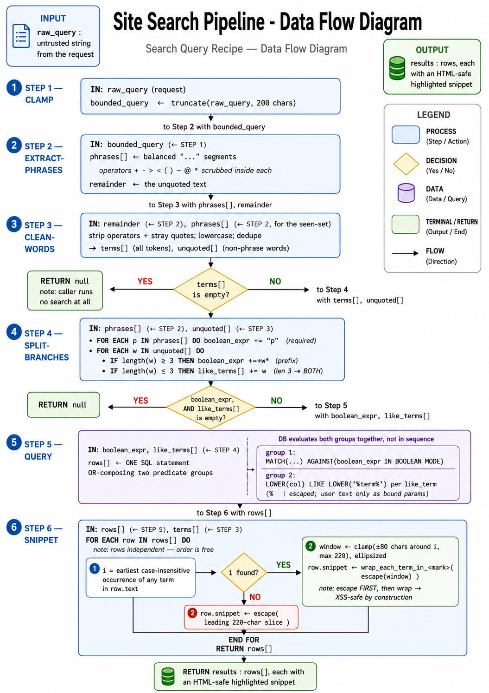

### Analysis — Site Search pipeline

**Edge cases**
- Empty, whitespace-only, or operator-only query → `null` at STEP 3 or 4;
  the pipeline ends before any SQL runs.
- All tokens short → `boolean_expr` empty; the LIKE group alone matches.
- A term straddling the snippet window edge → excerpt correct, highlight lost.

**Failure points**
- *Fail-closed:* FULLTEXT index missing on a drifted deployment → STEP 5
  raises a database error; the remedy is the schema-convergence script (§9.6).

**Efficiency**
- Parse: O(n) in query length, two regex passes, no DB access.
- Query: the FULLTEXT branch is index-backed; each LIKE term forces a scan —
  bounded in practice because `like_terms` only exist for tokens ≤ 3 chars.
- Snippet: O(t·n) per row; rows are independent.

**Potential improvements**
- Cache parsed queries for repeated searches (memoize on the raw string);
  cheap win, though parsing is already fast enough that the DB query dominates.
- Replace the LIKE recall branch with an n-gram or prefix index if short-token
  searches become common; costs index storage and write amplification for a
  currently-rare case.
- Multi-fragment snippets (highlight *all* windows containing terms, à la
  search engines) instead of only the first; more useful excerpts at ~2–3×
  snippet cost per row.

---

## 2. Blog

### 2.1 Excerpt generation — `seo_excerpt()` ([seo.php](public/app/helpers/seo.php)), `buildPostExcerpt()` ([ContentHelpers.php](public/app/lib/syndication/ContentHelpers.php))
- **Type:** Brute-force text truncation.
- **Logic:** Strip HTML, collapse whitespace, truncate at a character limit,
  append ellipsis. Deterministic, O(n), trivially finite.

### 2.2 Feed ingestion (RSS/Atom import) — [feed-ingest.php](public/app/helpers/feed-ingest.php)
- **Type:** Polling/scheduling loop + deduplication by key lookup.
- **Logic:**
  1. `refresh_due_feeds()` — a scheduler: iterate enabled sources, skip any not
     yet due (per-source interval check), ingest the rest; failures are
     isolated per source so one bad feed can't halt the loop.
  2. `parse_feed_xml()` — format detection (RSS vs Atom) followed by
     field-mapping extraction into a normalized item shape.
  3. `ingest_feed()` — for each parsed item, `feed_item_seen()` performs an
     exact-match GUID lookup (indexed search, effectively O(1) per item) and
     only unseen items are recorded — an idempotent set-insertion algorithm.
- **Characteristics:** Finiteness is guaranteed (bounded by source count ×
  items per feed); repeat runs with the same input converge to the same state
  (idempotence is the well-defined-output property applied to side effects).

### 2.3 Category slug uniqueness — `unique_category_slug()` ([slugify.php](public/app/helpers/slugify.php))
See §7.1 — shared with all sluggable content types.

### Recipe Overview — Feed import pipeline

This recipe empowers an admin to connect outside sources — another blog's RSS
or Atom feed, for instance — and have their entries appear on this site
automatically. It exists to spare the admin from copying content over by hand:
it checks each connected feed on a schedule, pulls in only entries it hasn't
seen before, and keeps running smoothly even when one source is broken.

### Recipe Pseudocode — Feed import pipeline

```
RECIPE Blog.FeedImport            (cron-triggered)
INPUT   enabled feed sources (feed_url, fetch interval, last status)
OUTPUT  new rows in feed_import_items; updated per-source status

STEP 1 — SCHEDULE      refresh_due_feeds()
  IN:    enabled sources
  FOR EACH source IN enabled_sources DO   // independent, try/catch-isolated
     IF NOT is_due(source) THEN CONTINUE          // skip: not yet due
     run STEP 2–4 for source
  END FOR
  RETURN count of feeds ingested

STEP 2 — FETCH         fetch_feed()          (body of STEP 1's loop)
  IN:    source.feed_url (← STEP 1)
  IF source.feed_url = '' THEN
     source.status ← 'error: No feed URL configured';  CONTINUE  // next source
  END IF
  xml ← http_get(source.feed_url)
  IF xml is null THEN
     source.status ← 'error: Failed to fetch feed';  CONTINUE
  END IF
  → STEP 3 WITH xml

STEP 3 — PARSE         parse_feed_xml()
  IN:    xml (← STEP 2)
  items[] ← map( detect(RSS | Atom), xml ) → {guid, title, content, dates}
            // feed_datetime(): unparseable date → null, never fabricated
  IF items[] is empty THEN
     source.status ← 'success';  CONTINUE          // empty feed is NOT error
  ELSE
     → STEP 4 WITH items[]
  END IF

STEP 4 — DEDUP + RECORD
  IN:    source.id, items[] (← STEP 3)
  FOR EACH item IN items[] DO
     IF feed_item_seen(source.id, item.guid) THEN
        CONTINUE                                   // re-runs are no-ops
     ELSE
        record_feed_item(item)   // insert carrying source_feed_id
     END IF
  END FOR
  source.status ← 'success'
  → STEP 1 (next source)                           // loop back-edge
```

### Recipe Instructions — Feed import pipeline

1. On a schedule, the system reviews every external feed (for example, another
   blog's RSS) that has been connected.
2. For each feed, it checks whether enough time has passed since the last
   check. If not, it skips that feed for now.
3. It downloads the feed. If the address is blank or the download fails, it
   records an error for that one feed and moves on to the next.
4. It reads the downloaded content, works out its format, and pulls out each
   entry (title, content, date, and a unique identifier). Missing or
   unreadable dates are left blank rather than guessed.
5. An empty feed is treated as a successful check, not an error.
6. For each entry, it checks whether that entry's unique identifier has been
   seen before. Already-seen entries are ignored, so re-running never creates
   duplicates.
7. New entries are saved, each tagged with which feed it came from.
8. Throughout, one broken feed never stops the others from importing.

### Recipe Diagram — Feed import pipeline

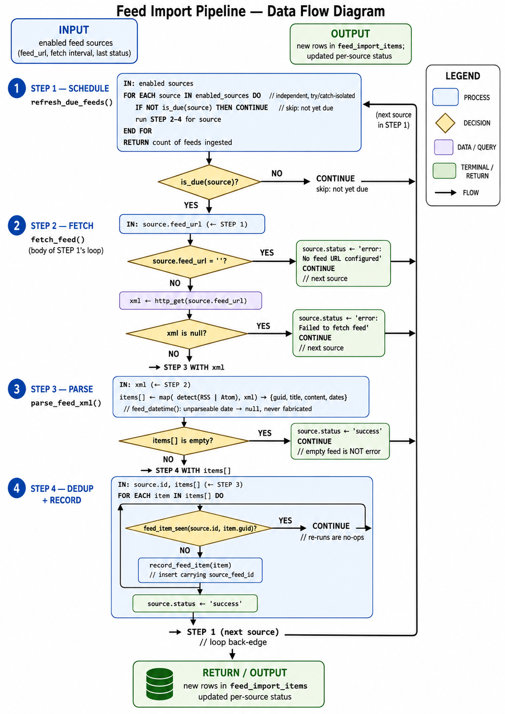

### Analysis — Feed import pipeline

**Edge cases**
- A feed that changes its GUIDs → items re-import as duplicates; GUID
  stability is an external dependency this pipeline cannot enforce.
- Zero-item feeds record `success`, not an error.
- Unparseable dates become `null`, never a fabricated timestamp.

**Failure points**
- *Fail-open:* any throw inside one source's STEP 2–4 is caught; the loop
  continues with the next source.
- *Fail-open:* `feed_import_items` table missing → the existence probe
  reports false → ingestion degrades to inactive, no crash.

**Efficiency**
- O(sources) scheduling + O(items) per feed with O(1) indexed GUID lookups.
- The dominant cost is network fetch, currently serial — total wall time is
  the sum of all feed response times.

**Potential improvements**
- Fetch due feeds concurrently (multi-curl); the per-source isolation already
  in place makes this safe. The biggest wall-time win available.
- Honor HTTP caching (ETag / If-Modified-Since) to skip STEP 3–4 entirely on
  unchanged feeds; requires storing validators per source.
- Batch STEP 4 inserts into one multi-row INSERT per feed; marginal unless
  feeds are large.

### Recipe Overview — Authored post pipeline

This recipe empowers an author to publish a post once and have it reach every
channel automatically. It exists so that a single act of writing does the work
of many: after the post is saved, the same content is given a clean web
address, made searchable, summarized for search-engine previews, and offered to
the social-media syndication process — without the author repeating themselves.

### Recipe Pseudocode — Authored post pipeline

```
RECIPE Blog.AuthoredPost
INPUT   post content + category from the admin editor
OUTPUT  published post consumed by search (§1), syndication (§8),
        and SEO meta

STEP 1 — SLUG
  IN:    post/category names (INPUT)
  slug ← RECIPE ContentMgmt.Slug (§7)
  → STEP 2 WITH slug

STEP 2 — STORE
  IN:    post content, category, slug (← STEP 1)
  row ← save(post)
  → STEP 3 WITH row

STEP 3 — FAN-OUT       (independent downstream consumers of the same row)
  IN:    row (← STEP 2)
  PARALLEL DO
     LEG A (render):    meta ← seo_excerpt(row.content)
     LEG B (search):    index row.content FOR RECIPE Search.Query
     LEG C (syndicate): row → RECIPE Syndication.Publish (§8)
  END PARALLEL
  RETURN            // no JOIN result — each leg serves a different reader

NOTE   imported posts (Blog.FeedImport) carry source_feed_id, which
       Syndication.Publish STEP 2 reads to suppress self-attribution.
```

### Recipe Instructions — Authored post pipeline

1. An author writes a post and assigns it a category in the admin editor.
2. The post's name is turned into a clean web address (see the Slug recipe).
3. The post is saved.
4. From there, the same saved post feeds three independent readers at once: a
   short summary is generated for search-engine previews, the content is added
   to the site's search index, and the content is handed to the syndication
   process for posting to social platforms.
5. Note: posts imported from an external feed are marked as such, which later
   tells the syndication process not to add an "original source on this site"
   footer.

### Recipe Diagram — Authored post pipeline

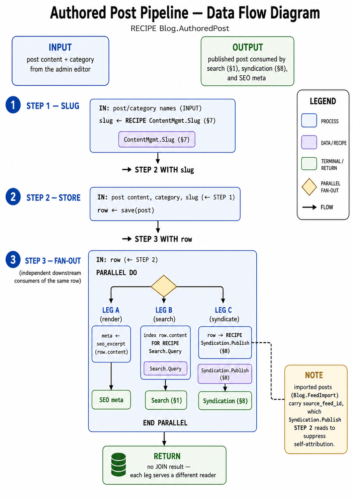

### Analysis — Authored post pipeline

**Edge cases**
- Feed-imported posts flow through the same downstream legs but carry
  `source_feed_id`, which changes syndication's footer decision (§8).

**Failure points**
- Inherits the slug race from ContentMgmt.Slug (§7 Analysis); no failure
  modes of its own beyond ordinary save errors.

**Efficiency**
- Single-row writes; the downstream legs each read the same stored content
  without transforming it twice.

**Potential improvements**
- Pre-compute and store the excerpt at save time instead of per render —
  trades a column for repeated strip/truncate work; only worth it if render
  volume is high.

---

## 3. Art Pieces (AI art pipelines)

### 3.1 Bounded generate-validate-repair loop — [PiecesAdminController.php](public/app/controllers/Admin/PiecesAdminController.php), [art-piece-generation.php](public/app/helpers/art-piece-generation.php)
- **Type:** Randomized algorithm (LLM sampling) wrapped in a bounded
  retry/feedback loop.
- **Logic:** Prompt an AI provider for engine-specific code (p5.js, Three.js,
  A-Frame, …); extract fenced code blocks; run static preflight validation
  (`art_piece_preflight_code/_document`) checking for forbidden constructs,
  media-reference policy, and engine-specific limits (e.g. counting Three.js
  object-construction calls). On failure, build a repair prompt embedding the
  failure message and previous response, and retry — up to
  `ART_PIECE_MAX_ATTEMPTS = 5` attempts with a 120 s per-attempt timeout.
- **Characteristics:** The LLM step is *not* deterministic (same input can
  yield different outputs — the article's randomized-algorithm class), so the
  system restores the other characteristics around it: **finiteness** via the
  hard attempt cap and timeout, and **well-defined outputs** via the validator,
  which acts as an acceptance predicate — only code passing every check is
  ever stored.

### 3.2 Media-reference validation — `validate_art_piece_prompted_media_refs()` and friends
- **Type:** Searching (pattern matching) + set-membership allowlisting.
- **Logic:** Regex-extract every media URL/`cms-media:` reference from
  generated HTML/CSS/JS, normalize each, and require membership in the allowed
  set derived from the prompt. Reject on any reference outside the allowlist.
- **Characteristics:** Unambiguous accept/reject predicate; O(n) scan of the
  generated code.

### 3.3 Refinement patch application — `art_piece_apply_refine_patches()` / `art_piece_find_patch_match()`
- **Type:** String searching with a whitespace-tolerant fallback matcher.
- **Logic:** Each LLM-produced patch is a SEARCH/REPLACE pair. Matching runs
  in two phases: (1) exact `substr_count` match — accept only if exactly one
  occurrence; (2) fallback: tokenize the SEARCH text into word-runs and
  individual symbols (whitespace discarded entirely), re-join with `\s*` into
  a regex, and match that. More than one match (either phase) → "ambiguous"
  and the patch is rejected; zero → rejected. Accepted patches are spliced in
  by offset.
- **Characteristics:** This is a deliberate unambiguity-enforcement algorithm:
  rather than guessing among multiple candidate locations, it refuses and
  triggers the repair loop (§3.1) with a corrective message. Only
  whitespace runs are interchangeable — every real token must match — so the
  well-defined-output guarantee (the right text is replaced or nothing is)
  holds. O(n·m) worst case for the regex phase.

### 3.4 Piece rendering and export — [piece-render.php](public/app/helpers/piece-render.php)
- **Type:** Template assembly / document generation (recursive descent over a
  parts tree: document → imports → runtime → bootstrap → user code).
- **Logic:** Builds a self-contained sandboxed HTML document per piece.
  Engine-specific bootstrap selection; for offline export, runtime sources are
  embedded and cross-module references rewired via `Blob` object-URLs (the
  OrbitControls source is patched to import Three.js from a generated blob URL
  — a small link-resolution/relocation algorithm, like a linker fixup pass).
  `piece_export_rewrite_media_refs()` rewrites `cms-media:` references through
  a resolver callback so exports carry their assets.
- **Module-syntax guard:** the ES-module → classic-script conversion of the
  bundled runtimes is verified, linker-style:
  `piece_export_strip_module_syntax()` rewrites mid-file
  `export function/const/class` to bare declarations, and
  `piece_export_assert_no_module_syntax()` then asserts (anchored regex, so
  `.export`/`exportFoo` can't false-positive) that no `import`/`export`
  keyword survives — throwing at export-*generation* time, where the error
  is actionable, rather than shipping a bundle that dies with a SyntaxError
  in the visitor's browser. Wired into all three
  `piece_export_*_global_source()` converters (three, OrbitControls,
  GLTFLoader).
- **Characteristics:** Fully deterministic given piece + version + options;
  language-independent in structure (an assembly recipe); the guard makes
  the conversion fail-closed server-side.

### 3.5 Canvas export with paint-readiness polling and blank detection — [public-piece-download.js](public/assets/js/public-piece-download.js), [admin-piece-capture.js](public/assets/js/admin-piece-capture.js), embedded copies emitted by [piece-render.php](public/app/helpers/piece-render.php)
- **Type:** Bounded polling loop + statistical classification heuristic.
- **Logic:** Before capturing a PNG, `hasVisiblePixels()` (defined in
  public-piece-download.js and duplicated into the export documents that
  piece-render.php generates — it is *not* part of immersive-gallery.js)
  samples the canvas and the loop waits/retries until non-blank or a retry
  cap is hit — finiteness imposed on an inherently asynchronous render.
- **Blank-frame classifier (admin capture):** admin-piece-capture.js goes
  further than a boolean pixel test: it computes per-pixel alpha-weighted
  luma, then `darkPixelRatio`, `nonDarkPixelRatio`, average luma, luma range,
  and `lumaVariance`/std-dev over a sample, and combines them in a fixed
  decision rule (e.g. ≥98.5% dark pixels with ≤0.2% non-dark and luma range
  ≤ 10 ⇒ blank). A PNG-encoding size check serves as a second cheap blank
  proxy — a near-empty canvas compresses to a tiny data URL. Readiness is
  confirmed with `requestAnimationFrame` chaining (the capture reads a frame
  that has actually presented) rather than the older fixed-interval poll.
- **Characteristics:** All thresholds are constants, so the classifier is a
  deterministic decision procedure; the statistical features only summarize
  the pixel sample. O(sampled pixels) per check.

### 3.6 Purpose-domain scoping — `art_piece_purpose_domain_header()` / `art_piece_normalize_purpose_domain()` / `art_piece_elide_out_of_scope_refs()` ([art-piece-generation.php](public/app/helpers/art-piece-generation.php))
- **Type:** Three-state scope selector + conservative pattern-elision rewrite.
- **Logic:** Every refine/regenerate request targets one of three purpose
  domains — `visual` (sound out of scope, sonic params carried forward
  unchanged), `audio` (visuals out of scope; no visual code shown, no visual
  patches accepted), `audio_visual` (both in scope). The header builder emits
  an explicit IN-SCOPE/OUT-OF-SCOPE directive per state;
  `art_piece_normalize_purpose_domain()` coerces any untrusted value outside
  the three-member set to `visual` (the historical default), so an unknown
  input can never produce an empty or ambiguous directive. In audio-only mode,
  `art_piece_elide_out_of_scope_refs()` rewrites visual asset references in
  the *context* prompt — same-origin `/image/N` and `/media/N` paths, and bare
  filenames with a visual/3D extension (png, jpg, glb, …) — into a labeled
  placeholder ("visual asset reference elided; out of scope"). This keeps the
  prose intelligible to the model while ensuring a tool-using provider proxy
  never treats an out-of-scope filename as a file to fetch.
- **Characteristics:** Unambiguous three-way dispatch; the elision is a pure
  O(n) regex rewrite, deliberately conservative (never matches bare words like
  `image` or extension-less names).

### 3.7 Export media reference resolution — `piece_export_collect_media_refs()` / `piece_export_resolve_media_ref()` / `piece_export_media_zip_path()` ([piece-render.php](public/app/helpers/piece-render.php))
- **Type:** Pattern harvest + multi-branch dispatch + collision-suffix probing.
- **Logic:** One shared regex harvests every same-origin media reference
  (`/image/N`, `/media/N`, `/media/{filename}`, `/api/media-assets/N`,
  optional query string) from the piece's html/css/js, normalized and deduped
  via a seen-set. `piece_export_resolve_media_ref()` dispatches on four path
  shapes to the right storage lookup (image by id with an `image/*` MIME
  guard, media by id, media-asset by filename, media-asset by id) and throws
  on anything unresolvable. `piece_export_media_zip_path()` assigns each asset
  a bundle path `media/{kind}-{id}.{ext}` and, on a name collision, probes
  `-2`, `-3`, … until free — the same linear-probing idea as slug uniqueness
  (§7.1) applied to zip entries. `piece_export_filename_extension()` resolves
  the extension from the original filename first, falling back to a fixed
  MIME→extension map (default `bin`). A-Frame documents additionally pass
  through `piece_aframe_normalize_texture_assets()` /
  `piece_aframe_add_crossorigin_to_asset_images()`, which rewrite `<a-assets>`
  image entries and inject `crossorigin` so textures load in the sandbox.
- **Characteristics:** Deterministic; fail-closed per unresolvable ref on the
  piece-export path (contrast the collection bundle's placeholder fallback,
  §5). O(code length) harvest + O(refs) resolution.

### 3.8 Shared view-state encode/decode with sanitization — `piece_export_decode_view_state()` / `piece_export_sanitize_view_state()` ([piece-render.php](public/app/helpers/piece-render.php)); `readViewVector()` / `shellViewState()` / `encodeViewState()` ([immersive-gallery.js](public/assets/js/immersive-gallery.js))
- **Type:** Validation chain (decode-then-clamp) over an untrusted encoding.
- **Logic:** The JS side quantizes camera/target vectors to 5 decimals
  (`shellViewState`) and encodes JSON → UTF-8 → base64 → URL-safe alphabet
  (`+`→`-`, `/`→`_`, padding stripped). The PHP decode side is the security
  boundary: reject anything empty, longer than 8192 chars, or outside the
  URL-safe charset; re-pad and strict-`base64_decode`; JSON-decode; then
  `piece_export_sanitize_view_state()` keeps only complete finite 3-vectors
  clamped to ±100000 per axis and an `activeIndex` clamped to 0–10000 — a
  crafted share URL cannot place the camera at garbage coordinates or index.
  Note the asymmetry: encode lives in JS, decode in PHP (the immersive
  collection view re-declares the JS encoder), so each side owns exactly the
  direction it needs.
- **Characteristics:** Fail-open by field — an invalid vector is dropped, not
  fatal; output is always a well-formed (possibly empty) state. O(1).

### Recipe Overview — AI Art Piece Generation pipeline

This recipe empowers an admin to create interactive artwork simply by
describing it in words, letting the AI write the underlying code. It exists so
that someone who isn't a programmer can still produce generative art safely:
the system spends AI budget only within limits, checks everything the AI
returns against safety rules, and retries with feedback until the result is
valid — saving nothing that fails.

### Recipe Pseudocode — AI Art Piece Generation pipeline

```
RECIPE ArtPiece.Generate
INPUT   admin prompt, engine/generation mode, optional cms-media: refs
OUTPUT  validated, versioned art piece — or accumulated failure after
        the attempt cap, with NOTHING stored

STEP 1 — RATE-GATE     rate_limit_consume('ai_generate_piece')
  IN:    scope + hashed admin subject
  verdict ← RECIPE Security.RateGate    (bucket: 4 req / 15 min)
  IF verdict = denied THEN
     ABORT "rate limited"   // reject with retry_after, before any AI spend
  ELSE
     → STEP 2
  END IF

STEP 2 — PROMPT-BUILD
  IN:    engine, prompt, media refs (INPUT)
  system_prompt ← engine_specific_prompt(engine)
  IF media refs present THEN
     system_prompt += media-policy paragraph (restrict to exactly those refs)
  END IF
  attempt ← 1
  → STEP 3 WITH system_prompt, user_prompt

STEP 3 — AI-CALL       AiProviderClient::generate()        [NON-DETERMINISTIC]
  IN:    prompts (← STEP 2, or repair_prompt ← STEP 6);
         vendor key ← RECIPE Security.Secrets
  raw_response ← call_provider(prompts, timeout = 120 s)
  IF timeout OR provider error THEN
     → STEP 6 WITH failure_message
  ELSE
     → STEP 4 WITH raw_response
  END IF

STEP 4 — EXTRACT       art_piece_extract_code_blocks()
  IN:    raw_response (← STEP 3)
  code ← extract fenced blocks (html / css / js)
  IF no code block found THEN
     → STEP 6 WITH failure_message
  ELSE
     → STEP 5 WITH code
  END IF

STEP 5 — VALIDATE      (acceptance predicate — BOTH checks must pass)
  IN:    code (← STEP 4), allowed media refs (INPUT)
  check_a ← static_preflight(code)   // forbidden constructs, engine limits
  check_b ← every media URL IN code ∈ allowed set
                                     // a /media/{id} 3D-model ref is allowed
                                     // exactly like an image ref; the runtime
                                     // provides THREE.GLTFLoader so the
                                     // code needs no forbidden import/fetch
  IF check_a fails OR check_b fails THEN
     → STEP 6 WITH exact failure_message    // first failure reported
  ELSE
     → STEP 7 WITH code
  END IF

  // SIDE CHANNEL (optional, piece-sound feature): a 4th ```sonic``` JSON
  // block may be present. It is soft-validated SEPARATELY (see §12) and
  // NEVER participates in the check_a/check_b accept/reject above — a bad
  // sonic block can't fail the code; it just means "no sound".

STEP 6 — REPAIR-OR-STOP
  IN:    failure_message (← STEP 3/4/5), raw_response, attempt
  IF attempt < 5 THEN
     repair_prompt ← build(failure_message + previous raw_response)
     attempt ← attempt + 1
     → STEP 3 WITH repair_prompt      // loop back-edge; each is its own
                                      // request, tracks attemptNumber/can_retry
  ELSE
     ABORT "5 attempts exhausted; NOTHING stored"
  END IF

STEP 7 — STORE
  IN:    accepted code (← STEP 5)
  version ← save_new_piece_version(code)
  RETURN version.id
```

### Recipe Instructions — AI Art Piece Generation pipeline

1. An admin describes the artwork they want and picks an engine (the drawing
   technology to use).
2. The system first checks a usage limit. If the admin has made too many
   requests recently, it stops immediately — before spending any money on the
   AI.
3. It assembles the instructions for the AI, adding rules about which images
   may be used if the admin referenced any.
4. It asks the AI to produce the code, allowing up to two minutes.
5. It pulls the code out of the AI's reply. If there is no code, that counts
   as a failure.
6. It checks the code against safety rules and confirms every referenced image
   is on the allowed list. If any check fails, that counts as a failure.
7. On a failure, if fewer than five attempts have been made, it tells the AI
   exactly what went wrong and tries again; after five attempts it gives up
   and saves nothing.
8. On success, the code is saved as a new version of the artwork.

### Recipe Diagram — AI Art Piece Generation pipeline

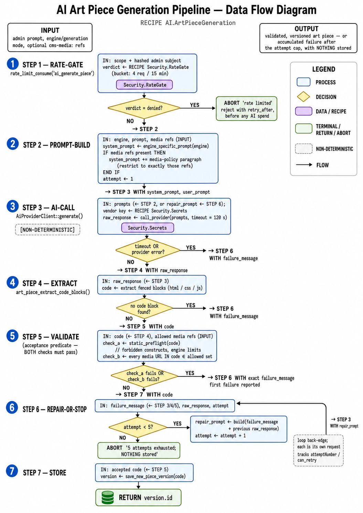

### Analysis — AI Art Piece Generation pipeline

**Edge cases**
- A response with no code block and a response failing validation both land
  in the same place — STEP 6 — never silently accepted.
- Media refs in the prompt but absent from the output are caught by the
  allowlist validator's required-refs mode.

**Failure points**
- *Fail-closed:* the validator is the acceptance predicate; after 5 attempts
  the admin gets the accumulated failure message and nothing is saved.
- *Contained:* validation is static, so code can pass preflight yet fail at
  runtime in the browser; the sandbox iframe and the `showPieceError`
  placeholder contain that case at display time.

**Efficiency**
- Cost is dominated by STEP 3 (paid AI call, up to 5 × 120 s worst case).
- Everything around it is O(code length) static analysis — deliberately cheap
  so a bad attempt fails fast and locally.
- The rate gate caps worst-case spend per admin per window.

**Potential improvements**
- Run STEP 5's two checks and report *all* failures at once (today the first
  failure wins) → richer repair prompts → likely fewer retries, at zero extra
  runtime cost.
- Stream the AI response and abort early when the output visibly violates
  preflight (e.g. a forbidden import appears) — saves tokens on doomed
  attempts; adds streaming-parse complexity.
- Persist failed attempts' messages per piece for offline prompt tuning;
  storage cost only.
- Surface sonic-coercion decisions to the admin (e.g. "requested 'harp' →
  using plucksynth") instead of coercing silently (§12); UI-only change.

### Recipe Overview — AI Art Piece Refinement pipeline

This recipe empowers an admin to adjust an existing artwork with a plain-
language request rather than by editing code themselves. It exists to make
iteration safe: the AI proposes precise find-and-replace edits, and the system
applies them only if every one matches the real code exactly — so a change is
either made cleanly and in full, or not at all, never leaving the artwork in a
broken half-edited state.

### Recipe Pseudocode — AI Art Piece Refinement pipeline

```
RECIPE ArtPiece.Refine
INPUT   refinement prompt + the piece's CURRENT html/css/js
OUTPUT  patched code stored as a new version — never a half-patched
        hybrid

STEP 1 — RATE-GATE     rate_limit_consume('ai_refine_piece')   (6 / 15 min)
  verdict ← RECIPE Security.RateGate
  IF verdict = denied THEN
     ABORT "rate limited"
  ELSE
     attempt ← 1;  → STEP 2
  END IF

STEP 2 — AI-CALL                                          [NON-DETERMINISTIC]
  IN:    refinement prompt + current code (INPUT, re-sent every attempt)
  prompt ← purpose-domain header (§3.6: visual | audio | audio_visual)
           + original prompt AS CONTEXT (audio-only: out-of-scope media
             refs elided per §3.6)
           + refinement instruction + current in-scope code
  response ← call_provider(prompt)   → plan + SEARCH/REPLACE patches[]
  → STEP 3 WITH patches[]

STEP 3 — MATCH         art_piece_find_patch_match()
  IN:    current code (INPUT), patches[] (← STEP 2)
  FOR EACH patch IN patches[] DO
     n ← exact substring count of patch.search IN code
     IF n = 1 THEN
        patch.offset ← position               // matched
     ELSE IF n > 1 THEN
        → STEP 5 WITH "ambiguous"              // whole set rejected
     ELSE  // n = 0 → whitespace-tolerant fallback
        pattern ← tokenize(patch.search) joined WITH \s*  // whitespace dropped
        m ← regex match count of pattern IN code
        IF m = 1 THEN patch.offset ← position
        ELSE → STEP 5 WITH "unmatched / ambiguous"
        END IF
     END IF
  END FOR
  → STEP 4 WITH patches[] (all matched)

STEP 4 — APPLY + STORE     (all-or-nothing)
  IN:    patches[] with offsets (← STEP 3)
  FOR EACH patch IN patches[] DO code ← splice(code, patch.offset, patch.replace)
  version ← save_new_piece_version(code)
  RETURN version.id

STEP 5 — REPAIR-OR-STOP
  IN:    rejection reason (← STEP 3), attempt
  IF attempt < cap THEN
     repair_prompt ← build(reason + RE-INCLUDED current source)
        // retry re-derives SEARCH from real code, not its own wrong output
     attempt ← attempt + 1
     → STEP 2 WITH repair_prompt            // loop back-edge
  ELSE
     ABORT "cap reached; stored code unchanged"
  END IF
```

### Recipe Instructions — AI Art Piece Refinement pipeline

1. An admin asks for a change to an existing artwork.
2. The usage limit is checked first, as with generation.
3. The AI is sent the request together with the artwork's current code, and it
   replies with a set of find-and-replace edits.
4. For each edit, the system locates exactly where it applies. If an edit's
   target cannot be found, or could match more than one place, the whole set
   is rejected — nothing is applied halfway.
5. If every edit matches cleanly, they are all applied together and saved as a
   new version.
6. If the set is rejected and attempts remain, the AI is asked to try again —
   and is re-shown the real current code so it can correct itself; otherwise
   the artwork is left unchanged.

### Recipe Diagram — AI Art Piece Refinement pipeline

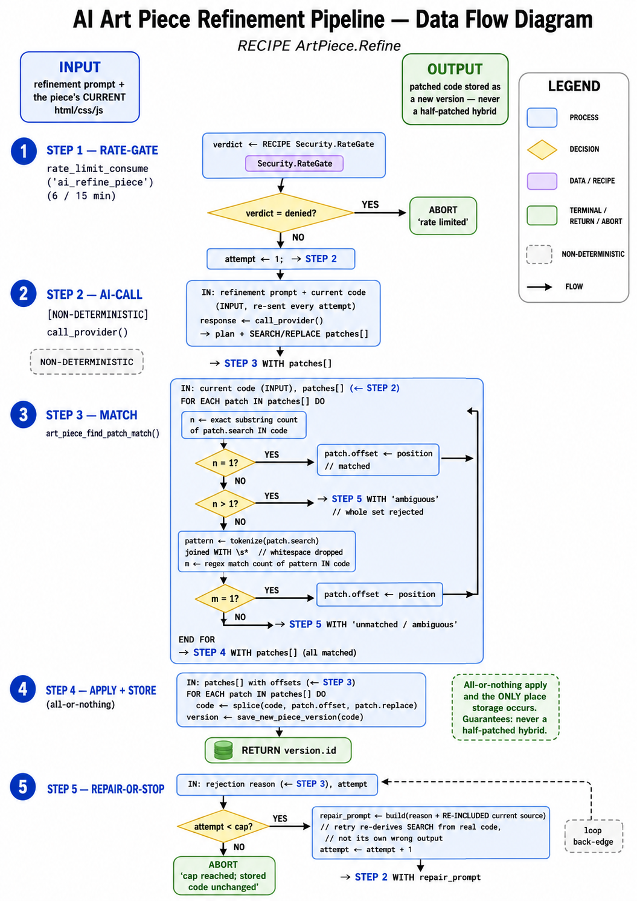

### Analysis — AI Art Piece Refinement pipeline

**Edge cases**
- Whitespace-only differences between the model's SEARCH text and the real
  code are tolerated; any real-token difference is not — the matcher cannot
  match the wrong content, only incidental reformatting of the right content.

**Failure points**
- *Fail-closed:* an ambiguous or unmatched patch aborts the whole set at
  STEP 5; stored code is never partially patched.

**Efficiency**
- Exact match is the fast path (`substr_count`, O(n)); the regex fallback is
  O(n·m) worst case but only runs on exact-match misses.
- Re-sending the full source each attempt costs tokens but is what makes
  retries converge.

**Potential improvements**
- Report *all* failed patches in one repair prompt instead of the first —
  same rationale as the generation pipeline.
- Anchor patches with line hints from the model to cheaply disambiguate
  multi-match cases before rejecting; adds prompt-format complexity.

### Recipe Overview — AI Art Piece Rendering / export pipeline

This recipe empowers visitors to view an artwork on the site and to download a
self-contained copy they can open offline. It exists so that generative work is
both live on the web and portable: it assembles each piece into a standalone
page, bundles in the libraries and images a download needs to run without an
internet connection, and captures a still image only once the artwork has
actually painted on screen.

### Recipe Pseudocode — AI Art Piece Rendering / export pipeline

```
RECIPE ArtPiece.RenderExport
INPUT   stored piece + version; target = public iframe | offline export
OUTPUT  sandboxed embed document, or standalone offline document

STEP 1 — ASSEMBLE
  IN:    piece, version (INPUT)
  document ← imports + runtime + engine_bootstrap(engine) + user code
  IF target = iframe THEN
     RETURN document                        // served; capture path not taken
  ELSE  // target = export
     → STEP 2 WITH document
  END IF

STEP 2 — EMBED-RUNTIME
  IN:    document (← STEP 1)
  PARALLEL DO                               // independent rewrites
     LEG A (runtime): inline runtime sources; wire cross-module imports via
                      Blob object-URLs (OrbitControls patched to import
                      Three.js from the generated blob URL)
     LEG B (media):   rewrite cms-media: refs → bundle-relative asset paths
  END PARALLEL
  RETURN standalone document                // download

STEP 3 — PNG-CAPTURE   (separate on-demand entry point, browser side)
  IN:    rendered canvas
  REPEAT
     visible ← hasVisiblePixels(canvas)
  UNTIL visible OR retry cap reached
  IF visible THEN
     blob ← letterbox(canvas INTO presentation surface);  download(blob)
     RETURN png
  ELSE
     ABORT "blank canvas — no image downloaded"
  END IF
```

### Recipe Instructions — AI Art Piece Rendering / export pipeline

1. The system takes a saved artwork and builds a self-contained web page for
   it.
2. If the page is for viewing on the site, it is returned as-is.
3. If the page is for download, the drawing libraries are bundled into it and
   image links are rewritten to point inside the download, so it works with no
   internet connection.
4. Separately, when someone saves a picture of the artwork, the system waits
   until the drawing has actually appeared on screen, then captures and
   downloads it. If nothing ever appears, it reports a failure instead of
   saving a blank image.

### Recipe Diagram — AI Art Piece Rendering / export pipeline

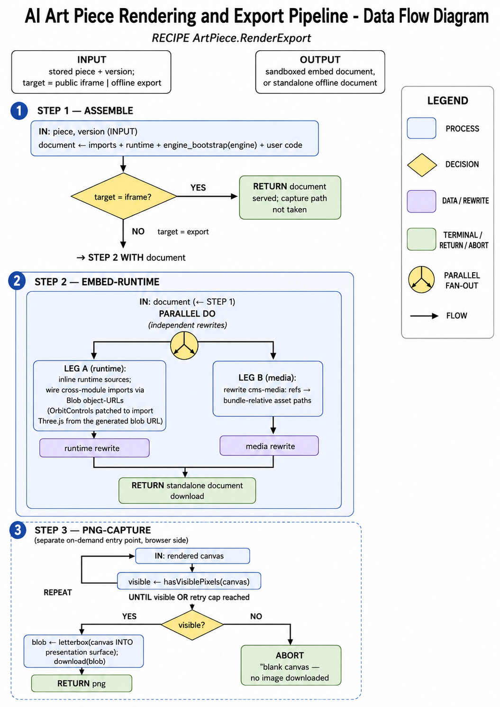

### Analysis — AI Art Piece Rendering / export pipeline

**Edge cases**
- The iframe and export paths share STEP 1's assembly, so embed and download
  render identically apart from where the runtime comes from.

**Failure points**
- *Contained:* validation upstream is static — exported code can still throw
  at runtime; the sandbox and `showPieceError` placeholder handle it.
- *Fail-closed:* a canvas that never paints exhausts the STEP 3 poll and
  reports failure rather than downloading a blank image.

**Efficiency**
- Assembly is string concatenation, O(document size); deterministic, and the
  export mode uses no network by design.

**Potential improvements**
- Cache assembled export documents per (piece, version) — they're immutable
  once a version exists, so invalidation is trivial (never), at the cost of
  storage.

---

## 4. Immersive Gallery / Exhibits ([immersive-gallery.js](public/assets/js/immersive-gallery.js))

### 4.1 Mounted-artwork layout — `computeMountedArtworkLayout()`, `computeExhibitGridCenterY()`
- **Type:** Geometric computation (closed-form, no iteration).
- **Logic:** Given an artwork aspect ratio and a layout profile, compute frame
  dimensions, wall placement, and camera-relevant centers with pure
  arithmetic; grid variants derive row/column world coordinates from counts.
- **Characteristics:** The textbook case of every characteristic at once:
  exact numeric inputs, exact numeric outputs, O(1), trivially portable.

### 4.2 Camera auto-fit — `fitMountedGalleryCamera()`, `computeThreeAutoFitView()`
- **Type:** Geometric optimization (closed-form).
- **Logic:** From the bounding size of the subject and the camera's vertical
  FOV, solve the distance at which the subject fills the frame
  (`d = size / (2·tan(fov/2))` scaled by a framing multiplier), with a
  compact-viewport branch for narrow screens.

### 4.3 Keyboard/orbit navigation — `computeOrbitKeyboardMotion()`, `createKeyboardNavigation()`
- **Type:** Vector math inside a fixed-timestep simulation loop.
- **Logic:** Project the camera's forward vector onto the ground plane,
  derive a strafe vector by cross product, sum contributions of currently-held
  keys, scale by speed, and translate camera + orbit target together each
  frame. Key-state is a set updated by keydown/keyup with blur-clearing to
  avoid stuck keys. Navigation is **arrow-keys-only**: `disableAFrameWASD()`
  (here and in piece-runtime.js) neuters A-Frame's built-in `wasd-controls`
  so letter keys stay free for the sonification piano mapping (§12) — the
  two keyboard consumers are partitioned by key range rather than by focus.

### 4.4 Floor click-to-walk — `createFloorClickNavigation()`
- **Type:** Ray casting (searching in 3D) + interpolation (easing loop).
- **Logic:** Distinguish click from drag by pointer-travel threshold; raycast
  from the click through the camera into the floor mesh; the hit point becomes
  a movement target approached by per-frame interpolation until within an
  epsilon — a finite convergence loop.

### 4.5 Progressive live-render budgeting — `getProgressiveExhibitLiveBudget()`
- **Type:** Greedy resource allocation.
- **Logic:** Only the k nearest/most-relevant exhibit items get live
  interactive renders (k chosen from viewport width and static-mode flag);
  the rest stay as static textures. A greedy heuristic in the article's sense:
  locally optimal (spend GPU on what's visible), fast, not globally optimal —
  chosen for feasibility (the "effectiveness and feasibility" characteristic)
  over exhaustive rendering, which would be infeasible on real hardware.

### 4.6 Presentation-surface letterboxing — `drawContainedIntoPresentationSurface()`
- **Type:** Geometric scaling ("contain" fit).
- **Logic:** `scale = min(destW/srcW, destH/srcH)`, center the scaled content,
  fill the margins with a background color. O(1) math, O(pixels) draw.

### 4.7 Greedy live-slot selection — `selectProgressiveExhibitSlots()`
- **Type:** Greedy selection (partial sort by weighted distance).
- **Logic:** The companion to §4.5's budget: for every piece-kind item, compute
  squared distance from its wall-slot center to the camera target with the z
  component down-weighted ×0.35 (depth matters less than lateral proximity on
  a wall), sort ascending, and take the first k (the live budget) as the set
  of live canvases. Non-piece items and items without centers never compete.
- **Characteristics:** Deterministic given camera target; O(n log n) for the
  sort, run only when the selection is refreshed — not per frame.

### 4.8 Auto-fit subject isolation — `autoFitCamera()`
- **Type:** Filtered spatial aggregation (bounding-box union with exclusion
  heuristics).
- **Logic:** Before framing generated Three.js content, traverse the scene and
  union world-space bounding boxes of only the objects that plausibly *are*
  the subject: skip helpers/lights/cameras/points, skip backface-only
  materials (`side === 1`, typical of sky-box interiors), skip meshes whose
  lowercased name matches environment words (sky, background, env, floor,
  ground, grid, dome, space, star), and skip oversized geometry (any dimension
  ≥ 30 world units; ≥ 15 for planes). The surviving union's center/size feed
  `computeThreeAutoFitView` (§4.2), and near/far planes are derived from the
  resulting distance. If the piece already positioned its camera, only the
  orbit target is recentred. A deliberately duplicated sibling `autoFit()`
  lives in [piece-runtime.js](public/assets/js/piece-runtime.js) for the
  standalone piece view; the duplication contract is guarded by
  [three-runtime-consistency.php](tests/three-runtime-consistency.php).
- **Characteristics:** A heuristic classifier, not exact — name matching and
  size thresholds can misjudge unusual scenes — but fail-soft: a wrong
  exclusion only affects framing, never rendering. O(scene objects).

### 4.9 Art-piece HTML sanitization and proxy-canvas mounting — `sanitizeArtPieceHtml()`, `normalizeCmsMediaPath()`
- **Type:** Recursive tree rewrite with element/attribute allowlists.
- **Logic:** `sanitizeArtPieceHtml()` walks the parsed DOM of a piece's HTML
  recursively: only `DIV` and `CANVAS` elements survive (anything else is
  unwrapped in place, preserving its children), and surviving elements keep
  only `id`, `class`, `style`, `width`, `height`, and `data-*` attributes —
  scripts, handlers, and every other vector are dropped structurally rather
  than pattern-matched. Wall mounting then uses a proxy-canvas pattern: the
  piece runs in a sandboxed `<iframe srcdoc>` or offscreen host, and its
  output is repainted onto a 2D display canvas that a `THREE.CanvasTexture`
  samples; SVG pieces are rasterized via a `data:image/svg+xml` Image draw.
  `normalizeCmsMediaPath()` enforces a same-origin CMS-path regex before any
  media URL is used as a texture source.
- **Characteristics:** Allowlist-by-construction (the output can only contain
  approved nodes/attributes — well-defined output in the strongest sense);
  O(nodes) per sanitize.

### 4.10 3D model loading via instrumented runtime — GLTFLoader wiring
- **Type:** Capability injection (controlled dependency provision).
- **Logic:** The gallery dynamically imports Three.js and `GLTFLoader` as ES
  modules and attaches the loader to the *instrumented* `THREE` proxy handed
  to generated code, so a piece that passed preflight can call
  `new THREE.GLTFLoader().load('/media/{id}', …)` without any forbidden
  `import`/`fetch` of its own — the allowlist validator (§3.2) still governs
  which model URLs are permitted. The offline export path substitutes
  blob-URL module sources (§3.4) so the same code runs with no network.
- **Characteristics:** Deterministic wiring; the algorithmic content is the
  contract — capabilities flow *to* validated code, never the reverse.

### Recipe Overview — Immersive viewing pipeline

This recipe empowers visitors to walk through the artwork as a 3D gallery
rather than scroll past flat thumbnails. It exists to present the work as an
exhibition experience while staying responsive on ordinary devices: it arranges
pieces on virtual walls, frames them with the camera, keeps only the nearest
few running live to protect performance, and lets people move around with
keyboard, pointer, or device tilt.

### Recipe Pseudocode — Immersive viewing pipeline

```
RECIPE Immersive.View
INPUT   piece/exhibit data (code, media, rows × cols), viewport size,
        input devices, optional encoded view-state from a shared URL
OUTPUT  interactive 3D gallery; on request: PNG snapshot or a
        shareable encoded view-state

STEP 1 — STAGE-SETUP
  IN:    environment (live site | offline export)
  runtime ← load(environment = live ? CDN : embedded blob-URL modules)
  stage   ← create Three.js stage + toolbar chrome
  → STEP 2 WITH stage

STEP 2 — LAYOUT        (closed-form, O(1) per item)
  IN:    aspect ratios, rows × cols, layout profile, viewport (INPUT)
  IF viewport is compact THEN profile ← compact ELSE profile ← standard
  positions ← { frame sizes  ← aspect;
                wall coords   ← row-major grid;
                camera centers ← row counts }
  → STEP 3 WITH positions

STEP 3 — CAMERA-FIT
  IN:    subject bounds (← STEP 2), fov, encoded view-state (INPUT)
  pose ← auto_fit:  d = size / (2·tan(fov/2)) · framing multiplier
  IF encoded view-state present THEN
     pose ← sanitize(view-state)    // clamp every value — a crafted URL
                                    // cannot place camera at garbage coords
  END IF
  → STEP 4 WITH pose

STEP 4 — RENDER-BUDGET (greedy)
  IN:    viewport width, static-mode flag (INPUT), items (← STEP 2)
  k ← live_budget(viewport width, static-mode)
  nearest k items → live interactive canvases (selectProgressiveExhibitSlots,
                    §4.7: weighted-distance sort, slice to k)
  remainder → static textures
  → STEP 5 WITH per-item render mode

STEP 5 — INTERACTION-LOOP
  IN:    input devices, render modes (← STEP 4)
  WHILE page open DO                        // one iteration per frame
     PARALLEL DO                            // independent event sources
        LEG A (keyboard):
           IF event target is a form field THEN IGNORE   // typing ≠ moving
           IF window blur THEN clear held-key set          // no stuck keys
           motion ← Σ held-key vectors (forward on floor plane,
                                        strafe by cross product)
        LEG B (pointer):
           IF pointer travel ≥ threshold THEN orbit only   // drag
           ELSE walk_target ← raycast(click → floor mesh)  // click
        LEG C (gyro):
           IF permission granted THEN camera ← orientation
           // else this leg never activates
        LEG D (audio — optional sonification, full algorithm in §12):
           IF current version has sonic params AND user enabled sound THEN
              motion_delta ← camera.position − previous_frame_position
              Tone.js ← map(motion_delta) per {tempo, scale, instrument}
           // Reads the SAME per-frame motion as LEG A/B/C — a listener, not
           // new tracking. Autoplay-gated; else this leg never sounds. The
           // regular /pieces/{id} view runs the same mapping in its own
           // iframe with the enable gesture relayed via postMessage (§12).
     END PARALLEL
     apply motion;  ease camera → walk_target UNTIL within epsilon;  render
     IF user requests capture THEN → STEP 6
  END WHILE

STEP 6 — CAPTURE       (on demand; returns to STEP 5)
  IN:    live canvas
  REPEAT visible ← hasVisiblePixels(canvas) UNTIL visible OR retry cap
         // hasVisiblePixels: public-piece-download.js (§3.5), shared here
  IF visible THEN
     download( letterbox(canvas) );  → STEP 5
  ELSE
     report capture failure (never a blank image);  → STEP 5
  END IF
```

### Recipe Instructions — Immersive viewing pipeline

1. The 3D gallery loads its viewing software and sets up the stage.
2. It calculates where each artwork hangs on the wall based on the artwork's
   shape and the grid size, adjusting the arrangement for small screens.
3. It positions the camera to frame the art. If the visitor arrived through a
   shared link that carries a saved viewpoint, that viewpoint is used — after
   being checked for sensible values.
4. To keep things running smoothly, only the nearest few artworks are shown
   "live"; the rest are shown as still images.
5. While the visitor is in the gallery, the system continuously responds to
   their keyboard, mouse or touch, and (if permission is granted) device tilt
   to move the camera around — ignoring keystrokes typed into text boxes and
   preventing keys from getting stuck.
6. If the visitor asks to save a picture, the system waits for the scene to be
   visible, then downloads it (or reports a failure if the scene is blank),
   and returns them to the gallery.

### Recipe Diagram — Immersive viewing pipeline

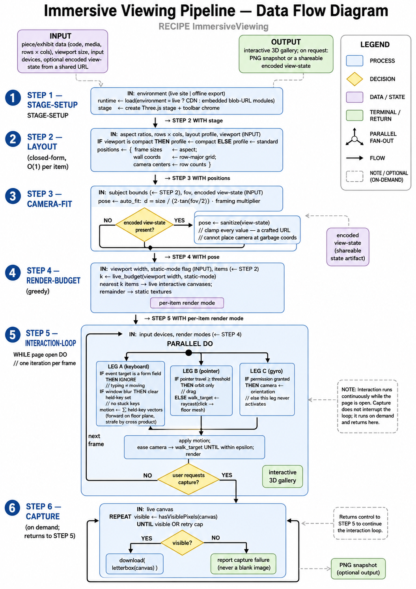

### Analysis — Immersive viewing pipeline

**Edge cases**
- ES-module sketches: `resolveSketchFactory` cannot parse them → those run
  via the srcdoc-iframe + proxy-canvas path instead (the wall-animation
  pattern).
- Devices without gyroscope permission → that input leg simply never
  activates.
- Audio autoplay policy → LEG D stays silent until the user taps "enable
  sound"; Tone.js is lazy-loaded then, and a failed load leaves rendering
  unaffected — same fail-open shape as the gyro permission gate. Focus
  handling, offline-export parity, and the full mapping algorithm are in §12.
- Typing in form fields and window blur are filtered/cleared so the camera
  never moves unintentionally and keys never stick.
- Toolbar affordances: PNG capture is a standalone always-visible screenshot
  button (`screenshot_action` in immersive-chrome.php); a single download
  item renders as a direct button, with a dropdown only when two or more
  exist.

**Failure points**
- *Contained, per item:* WebGL context loss or an artwork whose code throws →
  that item's error placeholder shows; the rest of the wall keeps rendering.
- *Fail-closed:* a blank canvas at capture time exhausts the readiness poll
  and reports failure rather than downloading an empty image.

**Efficiency**
- Layout and camera math are O(1) closed-form — no iteration, no layout
  thrash.
- Frame cost is dominated by the k live canvases, which is exactly what the
  greedy budget bounds. Event handlers are O(1).

**Potential improvements**
- Make the live budget dynamic: promote/demote items as the camera moves
  (distance-sorted priority queue) rather than fixing k at load; smoother
  close-up experience, adds texture-swap churn. If added, give §4.7's
  selection hysteresis (a promote threshold tighter than the demote
  threshold) so items near the budget boundary don't thrash between live
  and static as the camera drifts.
- Use measured frame time (not just viewport width) to size k — adapts to
  weak GPUs on large screens; needs a warm-up sampling window.
- OffscreenCanvas for live items where supported, moving piece rendering off
  the main thread; browser-support-gated.

---

## 5. Collections (downloads / bundling)

### 5.1 Bundle assembly — `collection_export_bundle()`, `collection_export_build_manifest()` ([piece-render.php](public/app/helpers/piece-render.php))
- **Type:** Divide-and-combine document generation.
- **Logic:** Decompose the export into independent sub-products — manifest,
  README, per-item payloads (`collection_export_items_payload()`), runtime
  files, media assets — build each, then combine into a single archive.
  Media URLs are rewritten to bundle-relative paths via the same resolver
  pattern as §3.4.
- **Characteristics:** Deterministic and finite; well-defined output is the
  point (the bundle must run standalone with no network).

### 5.2 Exhibit-wall grid in exports — `collection_export_document()`
- **Type:** Grid layout (row-major placement).
- **Logic:** Items are assigned `(row, col)` positions in row-major order over
  a `rows × cols` wall and mounted via the shared immersive runtime (§4).

### Recipe Overview — Collection download pipeline

This recipe empowers an admin or visitor to download a whole curated collection
as a single offline archive. It exists so that a grouping of works can be
shared or preserved as one unit: it packages every item and its media, rewrites
links to point inside the archive, bundles in the viewing software plus a
plain-language README, and produces one file that reproduces the gallery wall
with no internet connection.

### Recipe Pseudocode — Collection download pipeline

```
RECIPE Collection.Export
INPUT   collection record, ordered items (pieces w/ current versions
        and/or media assets), options (rows × cols, initial view-state)
OUTPUT  standalone archive that reproduces the gallery wall offline

STEP 1 — ITEM-PAYLOADS
  IN:    items[] (INPUT)
  FOR EACH item IN items[] DO           // items independent
     IF item is a piece THEN
        payload ← {engine, code, generation mode}
     ELSE  // item is media
        payload ← {resolved asset URL}
     END IF
     payloads[] += payload
  END FOR
  → STEP 2 WITH payloads[]

STEP 2 — MEDIA-REWRITE
  IN:    payloads[] (← STEP 1)
  FOR EACH payload IN payloads[] DO
     rewrite every cms-media: ref and /media/ URL → bundle-relative path
     IF a ref cannot be resolved THEN
        keep placeholder path           // one bad ref never breaks the bundle
     END IF
     queue referenced files
  END FOR
  → STEP 3 WITH payloads[], media_queue

STEP 3 — BUILD-PARTS
  IN:    payloads[], media_queue (← STEP 2)
  PARALLEL DO                           // legs consume STEP 2 independently
     LEG A (runtime):  copy immersive runtime source files INTO bundle
     LEG B (document): doc ← wall document, row-major (row, col), + scripts
                       IF items < grid cells THEN leave remaining cells empty
     LEG C (manifest): list every file the bundle will contain
     LEG D (readme):   generate README (notes the snapshot caveat)
  END PARALLEL
  → STEP 4 WITH {runtime, doc, manifest, readme}

STEP 4 — ARCHIVE
  IN:    all parts (← STEP 3), media_queue files (← STEP 2)
  archive ← combine(parts + media), named from collection slug
  RETURN archive
```

### Recipe Instructions — Collection download pipeline

1. The system gathers the collection's items in order (artworks and/or media).
2. Each item is turned into a self-describing package: artworks keep their
   code, and media keep their file links.
3. Every image link is rewritten to point inside the download, and the
   referenced files are gathered. If a file cannot be found, a placeholder
   link is kept, so one missing file does not break the whole download.
4. In parallel, the system copies the viewing software, builds a single
   gallery-wall page (leaving blanks if there are fewer items than wall slots),
   lists all included files, and writes a plain-language README.
5. Everything is combined into one downloadable archive named after the
   collection.

### Recipe Diagram — Collection download pipeline

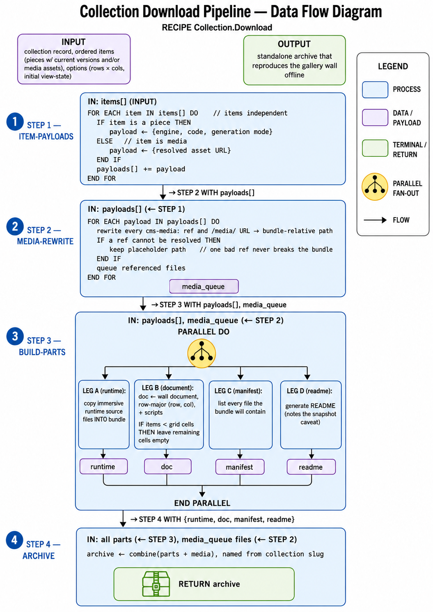

### Analysis — Collection download pipeline

**Edge cases**
- Mixed collections (pieces + plain media) are handled by the STEP 1 type
  branches.
- Fewer items than grid cells → remaining wall positions stay empty.
- An unresolvable media ref keeps a placeholder path — one bad ref never
  breaks the whole bundle.

**Failure points**
- *Inherent to snapshots:* the bundle reflects piece versions at export time;
  later edits don't propagate (stated in the README).
- *Unbounded input:* the archive grows linearly with media size; there is no
  cap in the assembly step, so the practical limit is server response limits.

**Efficiency**
- O(items + total media bytes). The PARALLEL structure of STEP 3 is logical
  today (execution is sequential) but shows nothing blocks true concurrency.
- The memory high-water mark is the full archive.

**Potential improvements**
- Stream the archive to the client (chunked zip) instead of building it fully
  in memory — removes the size ceiling; needs a streaming zip writer.
- Deduplicate media: a file referenced by several pieces stored once and
  referenced by path — a pure size win.
- Include a "re-export latest" link in the README pointing back to the
  collection URL, softening the snapshot-staleness caveat.

---

## 6. Comments & Reactions

### 6.1 Comment retrieval and shaping — [Comment.php](public/app/models/Comment.php)
- **Type:** Indexed lookup + linear mapping.
- **Logic:** `commentsFor(itemType, itemId)` is an indexed selection sorted by
  time (the sorting is delegated to the database's B-tree — O(log n) seek +
  ordered scan); `toApiPayloadList()` is a linear map to a fixed public shape,
  which is what makes the API output well-defined.

### 6.2 Ownership check — `comment_belongs_to_current_actor()` ([auth.php](public/app/helpers/auth.php))
- **Type:** Predicate (decision procedure).
- **Logic:** Resolve the current actor from whichever session exists (admin or
  user — the unified-auth model), then compare actor identity against the
  comment's stored author fields. Unambiguous boolean output.

### 6.3 Soft-delete / restore lifecycle — `softDelete()` / `restore()` / trash queries
- **Type:** State-machine transition (two states: active, trashed) implemented
  as a `deleted_at` timestamp toggle; all read algorithms filter on it, which
  keeps deletion reversible (supporting Rule 5/7 project constraints).

### Recipe Overview — Comment lifecycle pipeline

This recipe empowers logged-in users to discuss the site's items and empowers
admins to moderate that discussion. It exists to enable conversation while
keeping control and safety: anyone may read, only signed-in people may post,
authors and admins may edit or remove, and "deleting" only hides a comment so
it can be restored — with permanent removal reserved for the admin trash.

### Recipe Pseudocode — Comment lifecycle pipeline

```
RECIPE Comments.Lifecycle
INPUT   actor session (admin OR site-user — unified auth), comment
        text, target (itemType, itemId)
OUTPUT  ordered, shaped comment list per item; reversible trash state

STEP 1 — RESOLVE-ACTOR    current_comment_actor()
  IN:    whichever session exists
  actor ← resolve(session)
  IF actor is null THEN
     ABORT "write path refused"    // read path (STEP 3) stays open to all
  ELSE
     // caller's intent selects the path:
     → STEP 2 (create)  OR  → STEP 4 (edit / delete)   WITH actor
  END IF

STEP 2 — INSERT           insertComment()
  IN:    actor (← STEP 1), text + target (INPUT)
  row ← store(content, attribution = actor, target, timestamp)
  → STEP 3 (row now visible to reads)

STEP 3 — READ             (public path — needs no actor)
  IN:    itemType, itemId
  rows[] ← SELECT WHERE deleted_at IS NULL, time-ordered (DB B-tree)
  RETURN map(rows[] → FIXED public payload shape)  // only intended fields leave

STEP 4 — AUTHORIZE-MUTATION   comment_belongs_to_current_actor()
  IN:    actor (← STEP 1), comment.author fields
  IF actor is the author OR actor is admin THEN
     → STEP 5 WITH requested mutation
  ELSE
     ABORT "refused"
  END IF

STEP 5 — MUTATE           (state machine: active ⇄ trashed)
  IN:    mutation (← STEP 4)
  CASE mutation OF
     edit:       updateContent();  RETURN
     softDelete: set deleted_at;   RETURN   // hidden from all STEP 3 reads
     restore:    clear deleted_at; RETURN   // comes back EXACTLY as it was
     hardDelete: permanently delete (admin trash only);
                 RETURN   // IRREVERSIBLE — the only such transition here
  END CASE
```

### Recipe Instructions — Comment lifecycle pipeline

1. Someone tries to comment. The system identifies who they are from their
   login (admin or regular user). If they are not logged in, they cannot post
   — but anyone can still read.
2. To post, their comment is saved with their name, the item it belongs to,
   and the time.
3. To read, the system fetches all non-deleted comments for that item in time
   order and returns only the intended public fields.
4. To edit or delete, the system checks that the person is either the
   comment's author or an admin; otherwise it refuses.
5. Editing updates the text; "delete" simply hides the comment (and can be
   undone by restoring it); only a permanent delete from the admin trash is
   irreversible.

### Recipe Diagram — Comment lifecycle pipeline

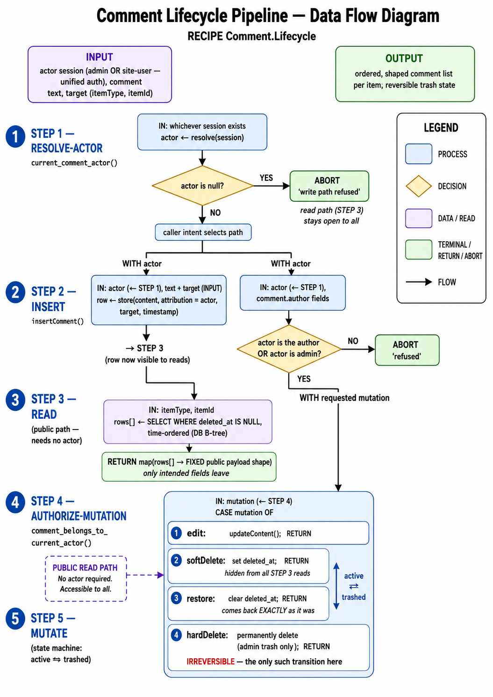

### Analysis — Comment lifecycle pipeline

**Edge cases**
- An author account deleted later → the comment still renders from its
  stored attribution.
- Restoring a trashed comment returns it exactly as it was — the toggle
  touches only `deleted_at`.

**Failure points**
- *Fail-open:* comments table missing on a fresh deployment → the memoized
  `tableExists()` probe makes the feature degrade to "no comments"
  (empty-database convention), no crash.
- Hard delete is the one irreversible transition and is reachable only
  through the admin trash.

**Efficiency**
- Reads are one indexed query + O(n) mapping. Writes are single-row.
- The memoized existence probe costs at most one query per request.

**Potential improvements**
- Paginate STEP 3 for heavily-commented items (currently bounded only by
  item popularity); straightforward LIMIT/OFFSET or keyset pagination.
- Cache the shaped payload list per item with invalidation on STEP 2/5 —
  worth it only if comment reads dominate.
- Aggregate reactions in SQL (GROUP BY) rather than shaping in PHP if counts
  become hot.

---

## 7. Content Management (shared by Blog, Pieces, Pages, Exhibits, Collections)

### 7.1 Slug generation with collision probing — `slugify()`, `unique_*_slug()` ([slugify.php](public/app/helpers/slugify.php))
- **Type:** Normalization + brute-force linear probing.
- **Logic:** Normalize (lowercase, strip non-letter/number/space/hyphen via
  Unicode classes, collapse separators to `-`), then probe `base`, `base-2`,
  `base-3`, … against the table until a free slug is found, excluding the
  record's own id on edit.
- **Characteristics:** Finite in practice (terminates at the first gap; k+1
  queries for k collisions). Deterministic given database state. The
  brute-force approach is chosen deliberately — collision counts are tiny, so
  anything cleverer would fail the feasibility-vs-complexity trade the source
  article describes.

### 7.2 Manual reordering — `reorder_shift_position()` ([reorder.php](public/app/helpers/reorder.php))
- **Type:** Array manipulation (remove-and-splice), i.e. an insertion step of
  insertion sort applied once.
- **Logic:** Load all active ids in current order; clamp the requested
  position to `[0, n−1]`; remove the moved id and splice it at the new index;
  rewrite `sort_order` as sequential integers 0..n−1 (which also
  self-normalizes any drifted ordering).
- **Characteristics:** Well-defined output — the invariant "sort orders are a
  contiguous permutation" holds after every call. O(n) with n writes.

### 7.3 Upload validation — `upload_media()` ([upload.php](public/app/helpers/upload.php))
- **Type:** Sequential decision procedure (validation chain).
- **Logic:** Resolve the *actual* MIME type from file content (not the
  client-supplied one), check it against an allowlist map, enforce a byte
  cap, then move to storage with a generated name. Fail-fast: the first
  failing check terminates with a specific error.
- **3D model branch (`upload_model_media()`):** GLTF/GLB are the one case
  where content-sniffing is *unreliable* (`.glb`→`application/octet-stream`,
  `.gltf`→JSON/text), so they are routed by **file extension** against
  `ALLOWED_MODEL_EXT` and then stored under a **canonical `model/*` MIME** —
  an extension-keyed variant of the same allowlist decision, chosen because
  the sniffed type cannot distinguish these formats. GLTF/GLB only: OBJ is
  deliberately unsupported (it typically needs companion .mtl/texture files
  this single-file flow can't carry). 64 MB cap; gated on the `media_models`
  feature.
- **Audio branch:** mp3/ogg/wav route through the normal MIME-sniffed
  allowlist (audio formats sniff reliably, unlike models) with a 32 MB cap,
  gated on the `media_audio` feature — these feed the sonification ambient
  sample (§12.7).

### 7.4 Navigation feature-gating — `ah_navigation_apply_feature_gating()` ([navigation.php](public/app/helpers/navigation.php))
- **Type:** Filtering (linear scan with predicate).
- **Logic:** Walk navigation items and drop any whose route maps to a disabled
  feature flag ([features.php](public/app/helpers/features.php)); falls back to
  a hardcoded generic set on an empty database (the "renders sensibly on an
  empty database" project convention).

### Recipe Overview — Path Slug pipeline

This recipe gives every page, post, or item a clean, readable, and permanent
web address derived from its name. It exists so that URLs are human-friendly and
never collide: it strips a name down to a safe form and, if that address is
already taken, appends a number until it finds a free one — while leaving an
item's existing address untouched when it is re-saved.

### Recipe Pseudocode — Path Slug pipeline

```
RECIPE ContentMgmt.Slug
INPUT   human-entered name (any Unicode); record's own id when editing
OUTPUT  unique URL-safe slug — a PUBLIC URL, therefore permanent
        under Rule 5 (never regenerated retroactively)

STEP 1 — NORMALIZE      slugify()
  IN:    name (INPUT)
  base ← name
         |> lowercase
         |> strip all but letters/numbers/spaces/hyphens (Unicode classes)
         |> collapse spaces/underscores + hyphen runs → single '-'
         |> trim edge hyphens
  → STEP 2 WITH base

STEP 2 — PROBE          unique_*_slug()
  IN:    base (← STEP 1), own id (INPUT)
  candidate ← base;  i ← 2
  WHILE candidate exists for a DIFFERENT id DO
     candidate ← base + '-' + i
     i ← i + 1
  END WHILE                         // k+1 queries for k collisions
  RETURN candidate                  // own id excluded → re-save keeps slug
```

### Recipe Instructions — Path Slug pipeline

1. Someone enters a name for a page, post, or other item.
2. The system converts it to a clean web address: made lowercase, reduced to
   letters, numbers, and hyphens, with spaces turned into hyphens and stray
   hyphens trimmed off the ends.
3. It checks whether that address is already taken by a different item. If it
   is, it tries the same address with "-2", then "-3", and so on until it
   finds a free one.
4. The free address is used. (When editing an existing item, that item's own
   address does not count as "taken," so saving again keeps it.)

### Recipe Diagram — Path Slug pipeline

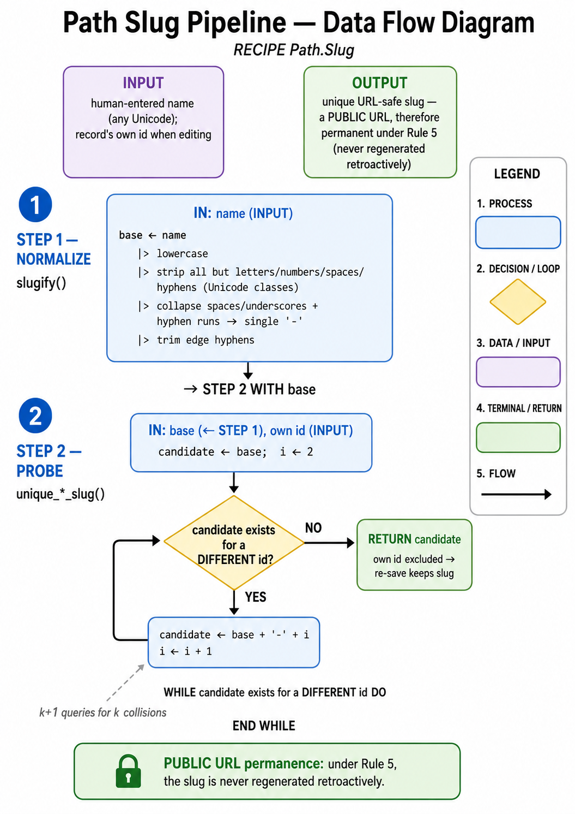

### Analysis — Path Slug pipeline

**Edge cases**
- A name made entirely of stripped characters (only punctuation) normalizes
  to an empty base — the probe still runs but yields a degenerate slug; the
  admin form's required-name validation is the practical guard.

**Failure points**
- *Race:* probe-then-insert is not atomic → two simultaneous saves of the
  same name can race; the database unique index is the backstop, turning the
  race into a visible save error rather than duplicate URLs.

**Efficiency**
- One query per probe; collisions are rare in practice, so the expected cost
  is ~1 query.

**Potential improvements**
- Close the race properly: attempt the INSERT and on duplicate-key error
  increment and retry (probe-by-insert) — atomicity without locks; slightly
  more complex error handling.
- Single-query probe: SELECT all slugs `LIKE 'base%'` once and pick the
  first gap in memory — k collisions in 1 query instead of k+1.

### Recipe Overview — Content Upload pipeline

This recipe empowers users to add images and videos to the site safely. It
exists to accept media while keeping the site secure: it reports precisely what
went wrong when an upload fails, identifies a file's true type by inspecting its
contents rather than trusting its name, rejects anything not on the allowed
list or over the size limit, and returns a stable web address for what it
stores.

### Recipe Pseudocode — Content Upload pipeline

```
RECIPE ContentMgmt.Upload
INPUT   browser file upload ($_FILES entry) + optional attributes
OUTPUT  media record at a stable /media/{id} URL

STEP 1 — ERROR-TRIAGE
  IN:    PHP upload error code (INPUT)
  IF code ≠ UPLOAD_ERR_OK THEN
     ABORT specific mapped message (size / partial / no file / no tmp dir …)
           + server's actual upload_max_filesize + post_max_size
           // so the admin sees WHICH limit bit them
  ELSE
     → STEP 2
  END IF

STEP 2 — DETECT-MIME    upload_resolve_mime()
  IN:    tmp file (← STEP 1)
  mime ← finfo(file bytes)          // client-declared type NEVER trusted
  IF mime undetectable THEN
     ABORT "type could not be detected"
  ELSE
     → STEP 3 WITH mime
  END IF

STEP 3 — ROUTE          upload_media_auto()
  IN:    mime (← STEP 2), file extension, media_models feature flag
  IF media_models enabled AND ext ∈ {glb, gltf} THEN
     // 3D models: sniffed MIME is unreliable, so route by EXTENSION and
     // store a canonical model/* MIME.  cap ← 64 MB   (upload_model_media)
     rules ← model ext-allowlist;  cap ← 64 MB
  ELSE IF mime ∈ {mp4, webm, mov} THEN
     rules ← video allowlist;  cap ← 64 MB
  ELSE IF media_audio enabled AND mime ∈ {mp3, ogg, wav} THEN
     rules ← audio allowlist;  cap ← 32 MB
  ELSE
     rules ← image allowlist (jpg/png/gif/webp/avif);  cap ← 8 MB
  END IF
  → STEP 4 WITH rules, cap

STEP 4 — ALLOWLIST + SIZE
  IN:    mime (← STEP 2), rules + cap (← STEP 3), file bytes
  IF mime ∉ rules THEN     ABORT "type not permitted"
  ELSE IF bytes > cap THEN  ABORT "exceeds the upload limit"
  ELSE                      → STEP 5
  END IF

STEP 5 — STORE
  IN:    blob, mime, original basename, attributes
  TRY raise session max_allowed_packet   // best-effort; failure swallowed
  id ← MediaFile::create(blob, mime, basename, attributes)
  RETURN {id, mime_type: mime, url: '/media/' + id}
```

### Recipe Instructions — Content Upload pipeline

1. Someone uploads a file.
2. The system first checks for upload errors and, if there is a problem,
   explains exactly which limit or issue caused it.
3. It determines the file's real type by inspecting its contents — not by
   trusting its name or extension. (3D models are the exception: because their
   real type cannot be told apart by inspection, they are recognized by their
   `.glb`/`.gltf` extension and then stored under a standard 3D-model type.)
4. Videos and 3D models are allowed up to 64 MB; audio files up to 32 MB;
   images up to 8 MB.
5. If the type is not on the allowed list, or the file is too big, it is
   rejected with a clear message.
6. Otherwise the file is stored, and the uploader gets back a permanent web
   address for it.

### Recipe Diagram — Content Upload pipeline

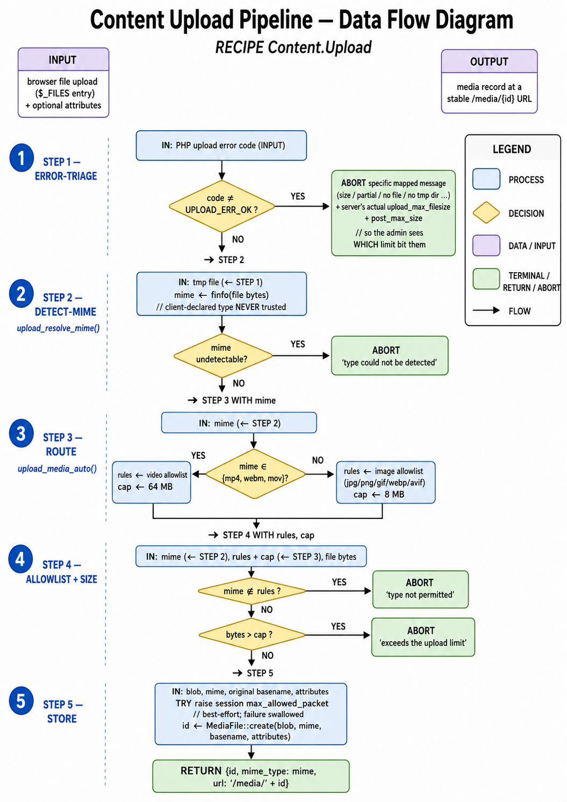

### Analysis — Content Upload pipeline

**Edge cases**
- A spoofed extension (renamed `.exe`) is classified by its real bytes at
  STEP 2 and rejected at STEP 4 — never by filename.
- A failed upload still routes through the image path purely to produce its
  specific STEP 1 error message.

**Failure points**
- *Fail-closed:* every check aborts the request with a message; the only
  fail-open step is the packet-size raise inside STEP 5, whose failure is
  swallowed because the insert may still succeed for smaller files.

**Efficiency**
- One `finfo` read + one full blob read; the blob is held in memory once
  (the STEP 4 size check reuses it for STEP 5).

**Potential improvements**
- Store media on disk/object storage with a DB pointer instead of a DB blob —
  removes the `max_allowed_packet` coupling and shrinks backups; a schema +
  serving-path migration (Rule 3 territory).
- Stream-hash the upload to detect duplicate media at STEP 5 and reuse the
  existing id; saves storage on repeat uploads.
- Add a magic-byte check for `.glb` uploads (binary glTF always starts with
  the 4-byte `glTF` header) — a cheap integrity check layered on the
  extension routing that content-sniffing can't provide for models; `.gltf`
  (JSON) has no equivalent signature.

### Recipe Overview — Content Reordering pipeline

This recipe empowers editors to arrange items — artworks, collections, menu
entries, and the like — into whatever order they choose. It exists so that
presentation order is under human control and stays consistent: it moves an
item to its new place and then renumbers the whole list cleanly, which also
quietly repairs any gaps or inconsistencies that had crept into the ordering.

### Recipe Pseudocode — Content Reordering pipeline

```
RECIPE ContentMgmt.Reorder
INPUT   item id, requested 0-indexed position, target table
        (fixed set of orderable tables)
OUTPUT  contiguous, gap-free sort_order (0..n−1) — repairs
        pre-existing drift as a side effect

STEP 1 — LOAD
  ids[] ← all non-deleted ids IN current sort_order
  → STEP 2 WITH ids[]

STEP 2 — LOCATE
  IN:    item id (INPUT), ids[] (← STEP 1)
  oldIdx ← index of id IN ids[]
  IF oldIdx not found THEN
     RETURN                          // silent no-op (e.g. trashed mid-edit)
  ELSE
     → STEP 3 WITH oldIdx
  END IF

STEP 3 — CLAMP
  IN:    requested position (INPUT), n = |ids[]|
  newPos ← max(0, min(n−1, requested))   // out-of-range can't scatter order
  IF newPos = oldIdx THEN
     → STEP 5                         // normalize only — no move needed
  ELSE
     → STEP 4 WITH newPos
  END IF

STEP 4 — SPLICE
  IN:    ids[], oldIdx, newPos (← STEP 2–3)
  remove ids[oldIdx];  insert id AT newPos
  → STEP 5 WITH reordered ids[]

STEP 5 — REWRITE
  IN:    ids[] (← STEP 4, or ← STEP 1 if normalizing)
  FOR EACH (index, id) IN ids[] DO
     UPDATE sort_order ← index WHERE row = id
  END FOR
  RETURN            // invariant restored: sort orders are 0..n−1 contiguous
```

### Recipe Instructions — Content Reordering pipeline

1. An editor moves an item to a new position in a list.
2. The system loads the current order of all items.
3. If the moved item is not found (for example, it was just deleted), it
   quietly does nothing.
4. It keeps the requested position within valid bounds.
5. It removes the item from its old spot and inserts it at the new spot.
6. It renumbers every item's position from the top, so the ordering stays
   clean and gap-free — which also tidies up any earlier inconsistencies.

### Recipe Diagram — Content Reordering pipeline

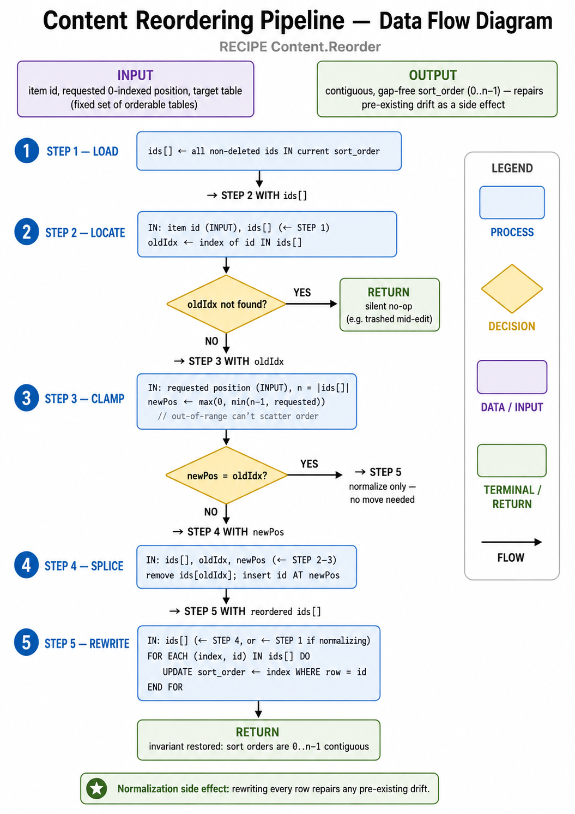

### Analysis — Content Reordering pipeline

**Edge cases**
- The moved item was trashed mid-edit → silent no-op at STEP 2.
- A same-position move still runs STEP 5, normalizing any drifted ordering.

**Failure points**
- *Transient:* STEP 5 is n individual UPDATEs, not one transaction → a
  mid-loop crash leaves a partially rewritten order; the next successful
  reorder renormalizes everything — the damage is temporary display order,
  never data loss.

**Efficiency**
- O(n) reads + O(n) writes per move — n UPDATE round trips is the dominant
  cost.

**Potential improvements**
- Wrap STEP 5 in a transaction: removes the partial-rewrite window at
  near-zero cost. The cheapest correctness upgrade in this file.
- Only rewrite rows whose sort_order actually changed (the slice between
  oldIdx and newPos) — cuts writes from n to |newPos − oldIdx|.
- Fractional ranks (midpoint keys) would make a move O(1), at the cost of
  periodic renormalization — overkill at current n.

---

## 8. Syndication (outbound to social/blog platforms) — [lib/syndication](public/app/lib/syndication)

### 8.1 Platform-specific post composition — `buildSocialPostText()` ([ContentHelpers.php](public/app/lib/syndication/ContentHelpers.php))
- **Type:** Constrained assembly (greedy truncation under a budget).
- **Logic:** Compose title + excerpt + hashtags + canonical URL under each
  platform's character limit, truncating the flexible parts (excerpt) first so
  the mandatory parts (URL, attribution) always survive — a greedy
  priority-ordered allocation. `ensureCanonicalUrl()` post-checks that the
  canonical link is present and appends it if truncation removed it.

### 8.2 Adapter dispatch — `AdapterFactory` + per-platform adapters
- **Type:** Strategy selection (table lookup).
- **Logic:** Map connection provider → adapter class; each adapter transforms
  the shared `SyndicationPayload` into that platform's API calls. The shared
  payload is the well-defined input contract that keeps every adapter's
  behavior comparable.

### Recipe Overview — Content Syndication pipeline

This recipe empowers an admin to reach audiences on outside platforms
automatically whenever a post is published. It exists to broaden a single
post's reach without extra manual effort: it tailors the wording to each
platform's length rules, always keeps the link back to the original, posts to
every connected account independently, and records each result so one failed
platform never blocks the rest.

### Recipe Pseudocode — Content Syndication pipeline

```
RECIPE Syndication.Publish
INPUT   published post (title, HTML content, category slugs, featured
        image), canonical URL, connected accounts (each with an
        encrypted OAuth token)
OUTPUT  platform posts always carrying the canonical back-link;
        per-connection delivery record in the admin

STEP 1 — PAYLOAD-BUILD
  IN:    post + canonical URL (INPUT)
  payload ← normalize(post) INTO shared SyndicationPayload
  payload.hashtags ← category slugs WITH hyphens removed
  payload.footer   ← buildSourceFooter()   // HTML + plain text
  → STEP 2 WITH payload

STEP 2 — FOOTER-DECISION   shouldAppendSourceFooter()
  IN:    post.source_feed_id (INPUT)
  IF post.source_feed_id is empty THEN
     keep payload.footer            // authored here
  ELSE
     drop payload.footer            // feed-imported → don't claim as origin
  END IF
  → STEP 3 WITH payload

STEP 3 — PER-CONNECTION DELIVERY
  IN:    payload (← STEP 2), connected accounts (INPUT)
  FOR EACH connection IN accounts DO   // independent; logically parallel,
                                       // sequential today; one failure
                                       // never touches another
     // ---- 3a COMPOSE   buildSocialPostText() ----
     limit ← platform limit (bluesky 300 | instagram 2200 |
             linkedin 3000 | facebook ~63k | unknown → 300)
     text  ← allocate budget IN PRIORITY ORDER:
             reserve URL + hashtags first; truncate excerpt to the rest

     // ---- 3b URL-GUARANTEE   ensureCanonicalUrl() ----
     IF canonical URL ∈ text THEN
        keep text
     ELSE IF text + URL fits limit THEN
        text ← text + URL          // re-truncate body as needed
     ELSE
        text ← truncate(URL)       // only imperfect case — pathological input
     END IF

     // ---- 3c DISPATCH   AdapterFactory ----
     adapter ← provider → adapter class
     token   ← decrypt(connection.token)   // RECIPE Security.Secrets
     IF platform = bluesky THEN
        text.card ← link-card {source: URL, title (fallback host), description}
     END IF
     result ← adapter.call_platform_api(text, token)
     // failure (expired token / API change / rate limit) is isolated here

     // ---- 3d RECORD ----
     write result (success | failure) TO post's syndication state
  END FOR
  RETURN delivery summary
```

### Recipe Instructions — Content Syndication pipeline

1. When a post is published, the system prepares a shared package of it,
   turning its categories into hashtags and preparing a source-credit footer.
2. If the post was imported from another site's feed, the footer is removed so
   this site does not claim to be the original source.
3. For each connected platform account, the system: writes a version of the
   post that fits that platform's length limit (always keeping the link and
   hashtags), makes sure the original link is present, and then posts it using
   that platform's connection — unlocking the stored access token first.
4. Each platform is handled independently, so a failure on one (for example,
   an expired login) is recorded but never blocks the others.

### Recipe Diagram — Content Syndication pipeline

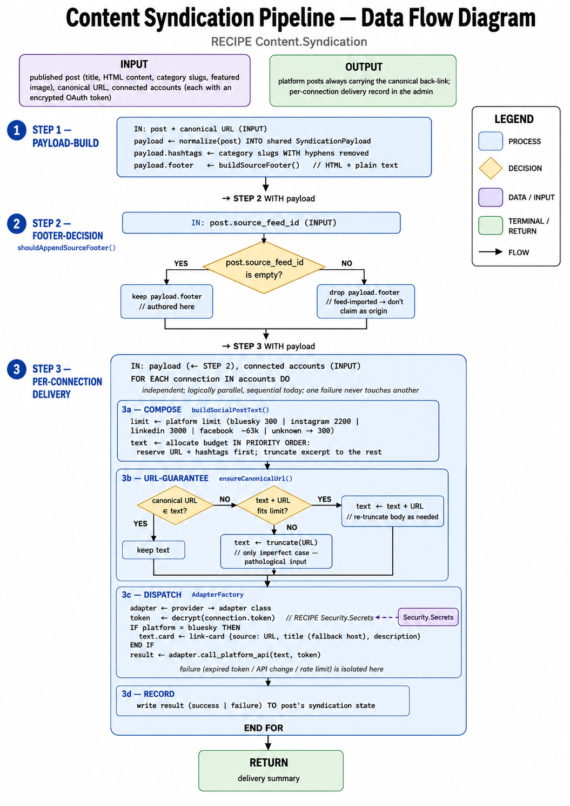

### Analysis — Content Syndication pipeline

**Edge cases**
- Composed text ends up empty → degrades to just the canonical URL.
- Budgets use byte-length `strlen` → multi-byte content truncates *more*
  conservatively than required — never over-limit, sometimes shorter than
  necessary.
- A canonical URL longer than the entire platform limit is itself truncated —
  the only case the back-link can be imperfect, caused by pathological input.

**Failure points**
- *Fail-open, per leg:* any platform failure (expired token, API change,
  platform rate limit) is recorded for that connection only and never blocks
  delivery to the others; token expiry routes the admin back through
  `Security.OAuth`.
- *Vendor dependency:* a platform changing its API breaks only its own
  adapter — the isolation the adapter pattern buys.

**Efficiency**
- Composition is O(text) per platform. Delivery legs are logically parallel
  but execute sequentially today — wall time is the sum of all platform API
  latencies.

**Potential improvements**
- Execute STEP 3 legs concurrently (or queue them as background jobs with
  per-leg retry) — publish latency drops to the slowest platform instead of
  the sum; needs a job runner.
- Count budgets in `mb_strlen` (or platform-specific grapheme rules) to stop
  over-truncating multi-byte content; a small correctness win.
- Automatic token refresh in STEP 3c where the provider supports it, before
  surfacing a delivery failure.

---

## 9. Security & Infrastructure (supports every function above)

### 9.1 Authenticated encryption — `encrypt_string()` / `decrypt_string()` ([encryption.php](public/app/helpers/encryption.php))
- **Type:** Cryptographic algorithm (AES-256-GCM via OpenSSL).
- **Logic:** Random 12-byte IV per encryption + authenticated cipher with a
  16-byte tag; output is `base64(iv).base64(tag).base64(ciphertext)`.
  Decrypt branches on format: two dots → current format; otherwise the
  legacy colon-separated format, with a second-chance key derivation
  (SHA-256 of the raw env value) for secrets written under the old scheme.
- **Characteristics:** Per the source article, cryptographic algorithms trade
  compute for security; the randomness (IV) means ciphertexts differ per run
  while decryption remains deterministic — well-defined round-trip output.
  GCM's tag verification makes tampering a detected failure, not silent
  corruption.

### 9.2 Fixed-window rate limiting — `rate_limit_consume()` ([rate-limit.php](public/app/helpers/rate-limit.php))
- **Type:** Counting algorithm over fixed time windows.
- **Logic:** Window start = `floor(now / windowSeconds) · windowSeconds`
  (aligning all requests in a window to one bucket key); an atomic
  `INSERT … ON DUPLICATE KEY UPDATE` increments the bucket counter; allow iff
  `count ≤ max` for the scope's rule; `retry_after` = time to window end.
  Expired buckets are garbage-collected opportunistically. Fails **open**
  (allows) if the table is missing or errors — availability over strictness.
  Configured scopes: `ai_generate_piece` 4/15 min, `ai_refine_piece` 6/15 min,
  `ai_process_text` 12/15 min, `ai_describe_image` 12/15 min, plus the OAuth
  scopes in §9.5; unknown scopes fall back to 10/5 min.
- **Characteristics:** O(1) per request; the atomic upsert removes the
  read-modify-write race, which is what makes the output well-defined under
  concurrency.

### 9.3 Privacy-preserving subject hashing — `operational_subject_hash()` ([audit-log.php](public/app/helpers/audit-log.php))
- **Type:** Keyed cryptographic hashing (HMAC-style).
- **Logic:** Hash `scope + subject` with a server-side secret seed so rate
  limits and audit trails can correlate a subject across requests without
  storing raw IPs/identities. One-way; deterministic per seed.

### 9.4 Audit-log redaction — `audit_log_redact_value()` / `audit_log_redact_array()`
- **Type:** Recursive traversal with a key-pattern denylist.
- **Logic:** Walk metadata arrays recursively; values under sensitive keys
  (tokens, secrets, passwords) are replaced with placeholders before storage.
  Finite because the input structure is finite and acyclic.

### 9.5 OAuth authorization-code flow — [oauth.php](public/app/helpers/oauth.php), [SharedAuthController.php](public/app/controllers/SharedAuthController.php)
- **Type:** Multi-step protocol (distributed state machine).
- **Logic:** Generate anti-CSRF `state` → redirect to provider → verify
  returned `state` (exact-match comparison) → exchange code for token →
  fetch profile → `oauth_allowed_identity()` allowlist check → establish
  session. Each transition validates its inputs before proceeding — the
  unambiguity characteristic applied to a protocol rather than a computation.

### 9.6 Schema convergence probing — [setup-database.php](scripts/setup-database.php), `*_table_exists()` helpers
- **Type:** Idempotent migration (probe-then-apply per manifest step).
- **Logic:** For each manifest step, probe current schema state
  (`INFORMATION_SCHEMA` lookups) and apply the step only if absent, so
  `git pull && php scripts/setup-database.php --yes` converges any deployment
  to the same schema regardless of starting state. Runtime helpers use the
  same probe pattern (memoized per request) to degrade gracefully when a
  table hasn't been created yet.
- **Probe family:** `ensureColumn`/`ensureIndex` probe existence;
  `ensureEnumValue()` probes *content* — it reads the column's current
  `COLUMN_TYPE` from `INFORMATION_SCHEMA`, string-scans it for each required
  `'value'`, and runs a single `MODIFY` to the full target definition only
  when one is missing. Idempotent like its siblings: a converged column is
  never touched. (Caveat inherent to the design: the MODIFY rewrites the
  whole ENUM list, so the manifest's `$fullDefinition` is the single source
  of truth for value order.)
- **Characteristics:** Idempotence = determinism of the *final state* rather
  than of the actions taken; finite (manifest is a fixed list).

### Recipe Overview — Secret storage pipeline (encryption)

This recipe protects the sensitive credentials the site depends on — AI keys
and platform login tokens — so they are never exposed even if the database is
read. It exists to keep those secrets usable but unreadable at rest: it
scrambles each one with strong encryption and a fresh random value, verifies a
secret hasn't been tampered with before ever handing it back, and refuses
rather than returning anything corrupted.

### Recipe Pseudocode — Secret storage pipeline (encryption)

```
RECIPE Security.Secrets
INPUT   plaintext secret (AI vendor key, OAuth token) +
        AI_SETTINGS_ENCRYPTION_KEY env value
OUTPUT  ciphertext at rest that round-trips deterministically;
        plaintext exists only in memory at the consumer

STEP 1 — DERIVE-KEY     ai_encryption_key()
  IN:    env value (falls back to the older PLATFORM_-prefixed name)
  // try encodings in order; first that yields 32 bytes wins
  IF env is 64-char hex THEN            key ← hex2bin(env)
  ELSE IF base64(env) is 32 bytes THEN  key ← base64_decode(env)
  ELSE IF length(env) = 32 THEN         key ← env
  ELSE
     ABORT "must decode to exactly 32 bytes"   // fail-CLOSED before any write
  END IF
  → STEP 2 (write path)  OR  STEP 3 (read path)   WITH key

STEP 2 — ENCRYPT        encrypt_string()        (write path)
  IN:    plaintext (caller), key (← STEP 1)
  iv ← random_bytes(12)                          [NON-DETERMINISTIC]
  (ciphertext, tag) ← AES-256-GCM(plaintext, key, iv)   // tag = 16 bytes
  RETURN base64(iv) + '.' + base64(tag) + '.' + base64(ciphertext)

STEP 3 — DECRYPT        decrypt_string()         (read path)
  IN:    stored ciphertext, key (← STEP 1)
  IF dot count = 2 THEN                           // current format
     (iv, tag, ct) ← base64_decode(parts)
     plaintext ← AES-256-GCM-decrypt(ct, key, iv, tag)   // tag verified first
     IF tag valid THEN RETURN plaintext ELSE ABORT "tampered ciphertext"
  ELSE                                            // legacy colon format
     plaintext ← try_decrypt(current key)
     IF tag valid THEN
        RETURN plaintext
     ELSE
        plaintext ← try_decrypt( sha256(raw env value) )   // legacy key
        IF tag valid THEN RETURN plaintext ELSE ABORT "decryption failed"
     END IF
  END IF
```

### Recipe Instructions — Secret storage pipeline (encryption)

1. When a secret (such as an AI key or a platform login token) needs to be
   stored, the system first prepares the encryption key from a setting,
   accepting a few common formats. If the setting is missing or malformed, it
   stops before storing anything.
2. To store a secret, it scrambles it with strong encryption, using a fresh
   random value each time, so the stored form is unreadable and looks
   different every time.
3. To read a secret back, it unscrambles the stored value, verifying it has
   not been tampered with before handing it over; older-format secrets are
   handled by a fallback. If verification fails, it refuses rather than
   returning corrupted data.
4. Note: if the encryption key is ever changed without re-scrambling the
   existing secrets, those secrets can no longer be recovered.

### Recipe Diagram — Secret storage pipeline (encryption)

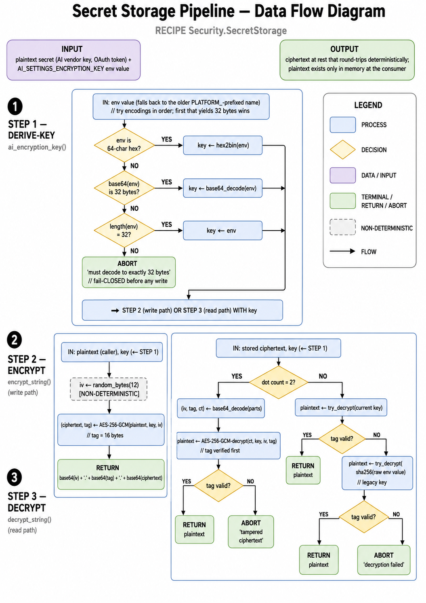

### Analysis — Secret storage pipeline (encryption)

**Edge cases**
- Legacy-format secrets decrypt via the fallback chain — no migration step
  was ever needed.
- The key is accepted in three encodings (hex, base64, raw 32 bytes), tried
  in a fixed order, so deployments can configure it whichever way their
  tooling prefers.

**Failure points**
- *Fail-closed:* a missing or malformed env key throws before any secret is
  written; a tampered or truncated ciphertext fails GCM tag verification and
  throws — garbage is never returned.
- *Undetectable:* rotating the env key without re-encrypting stored secrets
  makes them unrecoverable — the one operational hazard this design cannot
  detect.

**Efficiency**
- O(secret length); GCM is hardware-accelerated on modern CPUs. Key
  derivation is memoizable per request.

**Potential improvements**
- Key versioning: prefix ciphertexts with a key id so rotation becomes
  decrypt-with-old / re-encrypt-with-new instead of unrecoverable loss — the
  highest-value upgrade here.
- A one-time migration re-encrypting legacy-format secrets would let the
  legacy branch (and its extra failed-decrypt attempt on every legacy read)
  be deleted.

### Recipe Overview — Rate-limit gate pipeline

This recipe protects costly or abusable actions — AI requests, login attempts,
contact-form submissions — from being overused. It exists to cap spending and
deter abuse while respecting privacy: it counts how often each subject performs
an action within a time window (using a one-way identifier rather than raw
identities) and turns them away with a "try again later" once they exceed the
limit for that action.

### Recipe Pseudocode — Rate-limit gate pipeline

```
RECIPE Security.RateGate
INPUT   scope name (e.g. 'ai_generate_piece') + subject: admin
        identity id if logged in, else request fingerprint — both
        reduced to a KEYED HASH (no raw IP/identity stored)
OUTPUT  allow/deny + retry_after; consumed by AI endpoints, OAuth
        starts, contact form

STEP 1 — RULE           rate_limit_rule(scope)
  IF scope is known THEN rule ← its config (e.g. 4 / 900 s)
  ELSE                   rule ← default 10 / 300 s
  END IF
  → STEP 2 WITH rule

STEP 2 — BUCKET
  IN:    rule.window (← STEP 1), now
  window_start ← floor(now / window) · window    // one bucket key per window
  → STEP 3 WITH window_start

STEP 3 — GC + COUNT
  IN:    scope, subject_hash, window_start (← STEP 2)
  TRY
     DELETE buckets older than 2 days                // opportunistic GC
     atomic INSERT … ON DUPLICATE KEY UPDATE count+1  // removes RMW race
     count ← SELECT count back
  CATCH table missing OR any DB error
     RETURN allowed = true          // deliberate fail-OPEN
  END TRY
  → STEP 4 WITH count

STEP 4 — DECIDE
  IN:    count (← STEP 3), rule.max (← STEP 1)
  IF count ≤ max THEN
     RETURN allowed
  ELSE
     RETURN denied, retry_after = window_end − now
  END IF
```

### Recipe Instructions — Rate-limit gate pipeline

1. Before allowing a sensitive action, the system looks up how many times it
   is allowed within a set time window (with a default for anything unlisted).
2. It groups the current moment into a fixed time window.
3. It counts how many times this person has done this action within that
   window, clearing out old records as it goes.
4. If the count is within the limit, the action is allowed; otherwise it is
   denied with a "try again later" time.
5. Note: if the counting system is unavailable, the gate deliberately allows
   the action rather than blocking people — availability is chosen over strict
   enforcement.

### Recipe Diagram — Rate-limit gate pipeline

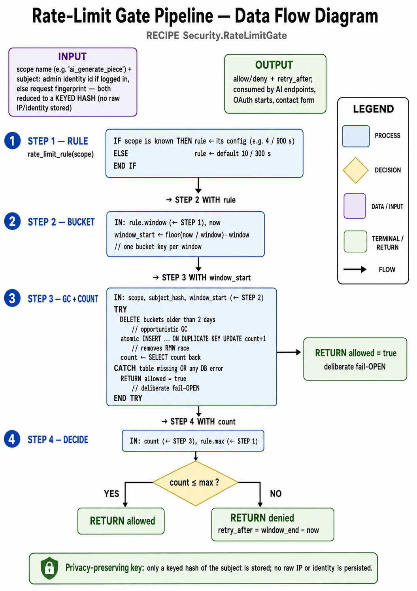

### Analysis — Rate-limit gate pipeline

**Edge cases**
- Fixed-window boundary → up to 2× the nominal rate across the seam (burst
  at the end of one window plus the start of the next); accepted as the
  standard trade-off for O(1) bookkeeping.

**Failure points**
- *Fail-open, deliberate:* STEP 3's catch-all returns *allowed* on a missing
  table or any DB error — a half-migrated deployment loses throttling, not
  functionality; the schema-convergence script (§9.6) closes the gap.

**Efficiency**
- O(1) per request: one upsert + one select (+ the opportunistic delete).
  No per-request table scans.

**Potential improvements**
- Sliding window (store the previous window's count and interpolate) to kill
  the 2× boundary burst — one extra column, same O(1).
- Move the GC delete to a cron instead of every request — removes a write
  from the hot path.
- Return the count from the upsert itself (`LAST_INSERT_ID` trick) to drop
  the follow-up SELECT — one round trip instead of two.

### Recipe Overview — OAuth login pipeline

This recipe empowers admins and users to sign in through an outside provider
(such as Google) instead of managing another password. It exists to make
sign-in both convenient and safe: it guards each step against forged logins,
confirms the returned identity is on the allowed list before creating a
session, and — because admin and public access are unified — grants access to
both sides of the site with one login.

### Recipe Pseudocode — OAuth login pipeline

```
RECIPE Security.OAuth
INPUT   visitor's provider-login click; provider env config (client
        id/secret, redirect URI); later, the provider's callback
        parameters (code, state)
OUTPUT  authenticated session — or a specific refusal at whichever
        step failed (every transition is fail-CLOSED)

STEP 1 — START
  IN:    provider choice (INPUT)
  IF RECIPE Security.RateGate('admin_oauth_start', 8 / 5 min) = denied THEN
     ABORT "rate limited"
  END IF
  state ← anti-CSRF token;  session.state ← state
  redirect → provider authorize URL
  → STEP 2   // when the provider calls back; control leaves this system
             // in between, and the session carries the state

STEP 2 — CALLBACK
  IN:    code + returned state (provider), session.state (session)
  IF RECIPE Security.RateGate('admin_oauth_callback', 12 / 5 min) = denied THEN
     ABORT
  END IF
  IF returned state ≠ session.state THEN
     ABORT "no session"             // CSRF or a stale tab
  END IF
  token ← exchange(code)
  IF exchange fails THEN ABORT "no session" END IF
  profile ← fetch_identity(token)
  → STEP 3 WITH profile

STEP 3 — ALLOWLIST      oauth_allowed_identity()
  IN:    profile (← STEP 2)
  IF profile ∉ configured identities THEN
     ABORT "no session"             // a valid provider login is NOT sufficient
  ELSE
     → STEP 4 WITH profile
  END IF

STEP 4 — SESSION
  IN:    verified identity (← STEP 3)
  admin_login_identity() / user_login()   // admin session = site-wide login
                                          // (unified auth: covers both surfaces)
  RETURN authenticated session
```

### Recipe Instructions — OAuth login pipeline

1. A visitor clicks to log in with an outside provider (for example, Google).
2. After a quick abuse check, the system creates a one-time security token and
   sends the visitor to the provider.
3. When the provider sends them back, the system verifies that the security
   token matches (guarding against forged logins), then exchanges the
   provider's code for an access token and fetches the person's profile.
4. It checks that the profile is on the list of allowed identities — a valid
   outside login on its own is not enough.
5. If allowed, it logs them in; a single login covers both the admin and
   public sides of the site.
6. Any failed step simply stops with no login created.

### Recipe Diagram — OAuth login pipeline

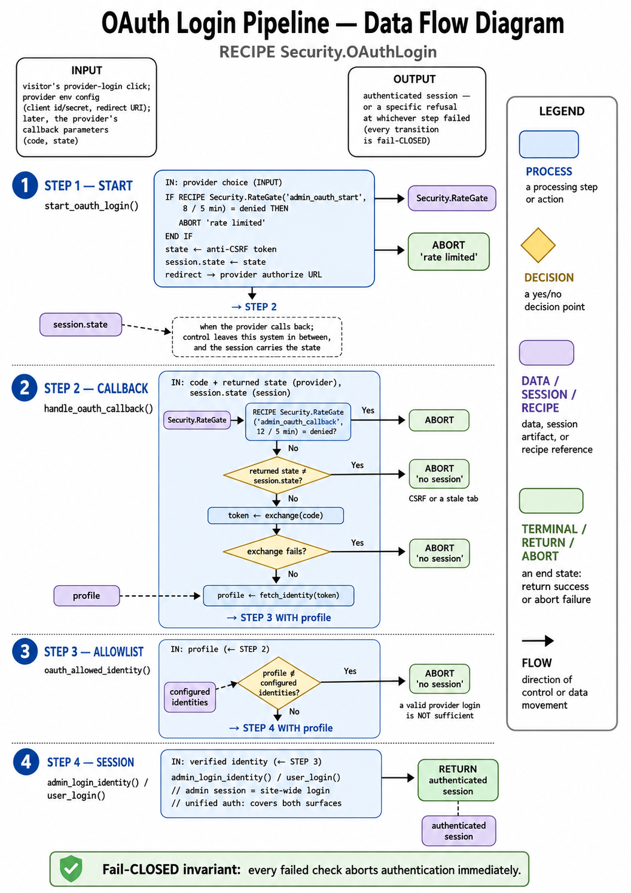

### Analysis — OAuth login pipeline

**Edge cases**
- Local development: `oauth_is_local_request()` permits localhost redirect
  URIs; `oauth_debug_detail()` surfaces provider error detail *only* in that
  local context.

**Failure points**
- *Fail-closed, every transition:* mismatched state (CSRF or a stale tab), a
  failed token exchange, or an off-allowlist identity each stop the flow
  with no session created.
- *External:* provider-side config changes surface as token-exchange
  failures at STEP 2.

**Efficiency**
- Two provider round trips (token exchange + profile fetch) dominate; local
  work is O(1).

**Potential improvements**
- PKCE (code_verifier/challenge) alongside `state` — hardens the code
  exchange at negligible cost; providers widely support it.
- Combine token + profile into one round trip where the provider returns an
  id_token (OIDC) — halves external latency.

---

## 10. Site Theme AI Generation ([site-theme-generation.php](public/app/helpers/site-theme-generation.php))

- **Type:** Same algorithm family as §3: randomized LLM generation inside a
  bounded validate-repair loop, plus the SEARCH/REPLACE patch matcher
  (`site_theme_find_patch_match()` mirrors §3.3) for refinements.
- **Difference:** The preflight (`site_theme_preflight()`) validates a
  CSS/JS/HTML triple destined for site-wide chrome rather than a sandboxed
  iframe, so its acceptance predicate is stricter about global side effects.

### Recipe Overview — AI Site theme generation pipeline

This recipe empowers an admin to restyle the entire site simply by describing
the look they want, letting the AI produce the styling and code. It exists to
let a non-coder redesign safely and reversibly: because a theme affects the
whole site rather than an isolated preview, every result is checked for safety
before it is applied, and each accepted theme is saved as a new version so the
previous one can always be restored.

### Recipe Pseudocode — AI Site theme generation pipeline

```
RECIPE SiteTheme.Generate
INPUT   admin's theme description prompt; for refinement, also the
        currently active theme's CSS/JS/HTML triple
OUTPUT  validated, versioned site theme; the prior theme is never
        destroyed by activation

STEP 1 — AI-CALL                                          [NON-DETERMINISTIC]
  IN:    theme prompt (or repair_prompt ← STEP 4)
  attempt ← attempt or 1
  raw_response ← call_provider()
  → STEP 2 WITH raw_response

STEP 2 — EXTRACT        site_theme_extract_code_blocks()
  IN:    raw_response (← STEP 1)
  triple ← extract CSS / JS / HTML
  IF triple incomplete THEN
     → STEP 4 WITH failure
  ELSE
     → STEP 3 WITH triple
  END IF

STEP 3 — PREFLIGHT      site_theme_preflight()
  IN:    triple (← STEP 2, or ← STEP 5 patched triple)
  // runs IN the site's OWN chrome, not a sandboxed iframe → load-bearing
  IF preflight fails THEN
     → STEP 4 WITH error
  ELSE
     → STEP 6 WITH triple
  END IF

STEP 4 — REPAIR-OR-STOP
  IN:    error (← STEP 2/3), previous response, attempt
  IF attempt < cap THEN
     repair_prompt ← build(error + previous response);  attempt ← attempt + 1
     → STEP 1 WITH repair_prompt            // loop back-edge
  ELSE
     ABORT "cap reached; active theme untouched"
  END IF

STEP 5 — REFINE         (alternate entry: patching an existing theme)
  IN:    current triple (INPUT), patches from the AI response
  apply matcher as RECIPE ArtPiece.Refine STEP 3 (all-or-nothing)
  IF all patches matched THEN
     → STEP 3 WITH patched triple           // re-preflight
  ELSE
     → STEP 4 WITH rejection
  END IF

STEP 6 — SNAPSHOT
  IN:    accepted triple (← STEP 3)
  version ← store(SiteThemeSnapshot)   // previous theme remains restorable
  RETURN version
```

### Recipe Instructions — AI Site theme generation pipeline

1. An admin describes a look for the whole site.
2. The AI is asked to produce the theme's styling and code.
3. The result is pulled out and checked for safety — and because a theme
   affects the entire site (not an isolated preview), this check is especially
   important.
4. If it fails and attempts remain, the AI is told what went wrong and tries
   again; otherwise the current theme is left untouched.
5. When refining an existing theme, the edits are matched against the real
   current theme (all-or-nothing) and the result is re-checked before saving.
6. An accepted theme is saved as a new version, and the previous theme is kept
   so it can be restored.

### Recipe Diagram — AI Site theme generation pipeline

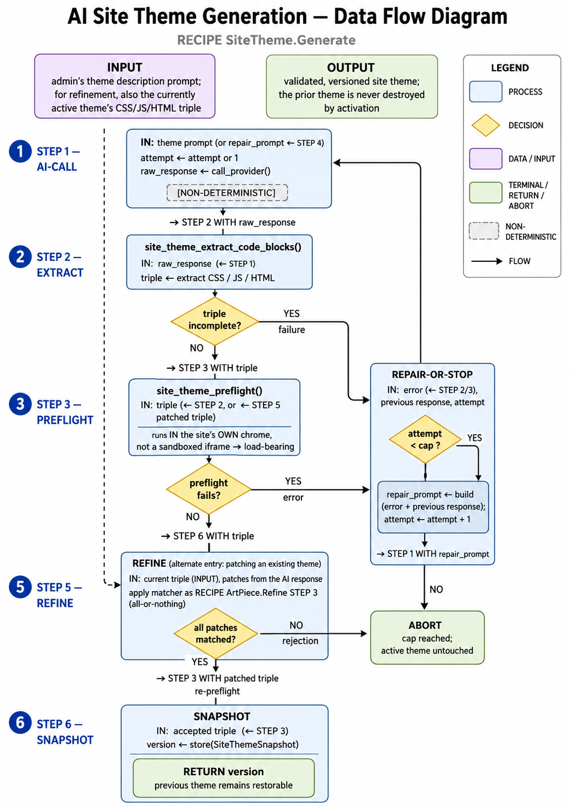

### Analysis — AI Site theme generation pipeline

**Edge cases**
- Refinement re-enters the main flow at STEP 3: a patched triple is
  re-preflighted before it can ever be stored.

**Failure points**
- Same shape as §3: non-determinism is contained by validator + retry cap;
  ambiguous patches abort rather than guess, and a failed run leaves the
  active theme untouched.
- *Residual:* preflight is static → a theme can validate yet misbehave
  visually at runtime; snapshot history is the recovery path, keeping even
  that failure reversible.

**Efficiency**
- Same profile as ArtPiece.Generate — the AI call dominates; everything
  local is O(code length).

**Potential improvements**
- Same as ArtPiece.Generate (report all preflight failures at once; persist
  attempt history), plus:
- A staged "preview" activation rendering the candidate theme in an isolated
  preview session before it touches live chrome — converts the residual
  static-validation risk from restore-after to catch-before.

---

## 11. AI Provider Client ([AiProviderClient.php](public/app/lib/ai/AiProviderClient.php))

The transport layer beneath every AI pipeline in this file (§3, §10, and the
text/image AI helpers). It turns "call the configured model" into a
well-defined operation across six vendors and four incompatible API shapes.

### 11.1 Transport/endpoint selection — `getTransportAttempt()` and the OpenCode variants
- **Type:** Strategy selection (nested dispatch: vendor → endpoint kind →
  model-slug prefix).
- **Logic:** The vendor maps directly to an endpoint for single-API vendors
  (OpenRouter, DeepSeek, Mistral → chat-completions; Google →
  generateContent). The OpenCode gateways multiplex several API families
  behind one host, so their branch dispatches first on an explicit
  `endpointKind` override, then on model-slug prefix conventions (`gpt-` →
  OpenAI responses, `claude-` → Anthropic messages, `gemini-` → Google, a
  prefix/member set for chat-completions models); an unrecognized slug throws
  rather than guessing an endpoint.
- **Characteristics:** Total, deterministic dispatch with an explicit failure
  case — the unambiguity characteristic applied to routing. O(1).

### 11.2 Model-id normalization — `normalizeModelForProvider()`, `isPrefixOf()`
- **Type:** String normalization (prefix stripping / prefix classification).
- **Logic:** Strips the `opencode-go/` namespace prefix before the id is sent
  to the provider; `isPrefixOf()` is the shared prefix classifier the routing
  above builds on.

### 11.3 Per-vendor response-shape extraction — `extractChatCompletionText()` / `extractGoogleText()` / `extractOpenAiResponsesText()` / `extractAnthropicText()`
- **Type:** Structural parsing (shape-tolerant tree walks).
- **Logic:** One extractor per API family walks that family's response
  structure (choices→message→content; candidates→content→parts;
  output→content→output_text items; content→text items), tolerating both
  string and array content forms, concatenating text parts, and returning
  `null` — never a fabricated string — when the shape doesn't match.
- **Characteristics:** Well-defined output: the caller receives either real
  model text or an explicit absence. O(response size).

### 11.4 Truncation detection — `extractFinishReason()` + `finishReasonMeansTruncated()`
- **Type:** Cross-vocabulary classification (normalization to a boolean
  predicate).
- **Logic:** Each API family names its stop reason differently
  (`finish_reason`, `stop_reason`, `finishReason`,
  `incomplete_details.reason`/`status`); the extractor reads the right field
  per kind, and the predicate maps the vendor vocabulary
  {`length`, `max_tokens`, `max_output_tokens`, `incomplete`} to one meaning:
  "cut off by the output-token limit." Callers use this to distinguish a
  truncated response from a wrong one, and output budgets are set per vendor
  (16384 tokens for DeepSeek/OpenCode, 8192 otherwise) to make truncation
  rare in the first place.

### Recipe Overview — AI provider call pipeline

This recipe underpins every AI feature on the site — art generation, theme
generation, text processing, image description. It exists so those features
can treat "ask the model" as one dependable operation even though each vendor
speaks a different protocol: it routes the request to the right endpoint for
the configured vendor and model, translates the reply's vendor-specific shape
into plain text, and reports precisely how the call ended — including whether
the reply was cut short — so the calling pipeline can retry intelligently.

### Recipe Pseudocode — AI provider call pipeline

```
RECIPE AiProvider.Call
INPUT   system + user prompts; configured vendor, model, endpoint kind;
        decrypted vendor key (← RECIPE Security.Secrets)
OUTPUT  {ok, text, error, finishReason} — text is real model output or
        absent, never fabricated

STEP 1 — ROUTE          getTransportAttempt()
  IN:    vendor, model, endpointKind (INPUT)
  CASE vendor OF
     single-API vendor:  transport ← its fixed endpoint
     opencode gateway:   IF endpointKind set THEN transport ← that family
                         ELSE transport ← by model-slug prefix
                              (gpt-→responses, claude-→messages,
                               gemini-→generate-content, known set→chat)
                         IF slug unrecognized THEN ABORT "unknown model"
  END CASE
  → STEP 2 WITH transport

STEP 2 — REQUEST                                          [NON-DETERMINISTIC]
  IN:    transport (← STEP 1), prompts, key (INPUT)
  model ← normalizeModelForProvider()        // strip gateway namespace
  body  ← format prompts per transport.kind; max_tokens per vendor
          (16384 deepseek/opencode | 8192 others)
  response ← http_post(transport.url, body, key)
  IF transport error THEN
     RETURN {ok: false, error, finishReason: null}   // caller owns retries
  ELSE
     → STEP 3 WITH response
  END IF

STEP 3 — EXTRACT        per-family extractor
  IN:    response, transport.kind (← STEP 2)
  text ← walk response per kind's shape; join text parts
  IF shape does not match THEN text ← null       // absence, not invention
  finishReason ← kind-specific stop-reason field
  → STEP 4 WITH text, finishReason

STEP 4 — CLASSIFY-END   finishReasonMeansTruncated()
  IN:    text, finishReason (← STEP 3)
  truncated ← finishReason ∈ {length, max_tokens, max_output_tokens,
                              incomplete}
  RETURN {ok: text present, text, finishReason, truncated}
         // consumers (§3, §10) fold this into their repair loops
```

### Recipe Instructions — AI provider call pipeline

1. A feature (art generation, theme generation, and so on) asks for an AI
   response, naming the configured provider and model.
2. The system works out which of the provider's service addresses to call —
   directly for simple providers, or by recognizing the model's name family
   for gateway providers that host many kinds of models. An unrecognizable
   model name stops the call rather than guessing.
3. It formats the request the way that service expects, unlocks the stored
   provider key, and sends it.
4. It reads the reply using the matching format rules and pulls out the text.
   If the reply doesn't look as expected, it reports "no text" rather than
   inventing something.
5. It also reads how the reply ended — in particular whether the provider cut
   it off for being too long — and passes that along, so the calling feature
   knows whether to retry, repair, or give up.

### Recipe Diagram — AI provider call pipeline

<!-- diagram pending — generate via the diagram thread -->


### Analysis — AI provider call pipeline

**Edge cases**
- Array-form message content (some chat-completions providers) is joined
  part-by-part, same as string content.
- A gateway model slug with an explicit `endpointKind` override skips prefix
  guessing entirely — the escape hatch for new model families.
- An empty-but-well-formed reply returns `ok: false` with no text, which the
  §3/§10 repair loops treat like any other failed attempt.

**Failure points**
- *Fail-closed:* unknown vendor or unrecognized gateway slug throws before
  any network call.
- *Fail-open to the caller:* HTTP and unexpected errors return a structured
  `{ok: false, error}` rather than throwing — the calling pipeline's bounded
  retry loop (§3.1) is the recovery mechanism.
- *Vendor dependency:* a provider changing its response shape breaks only its
  extractor; the others are untouched (same isolation argument as §8's
  adapters).

**Efficiency**
- The network round trip dominates; routing and extraction are O(1) and
  O(response size). No retries happen at this layer — retry cost is owned and
  bounded by the callers.

**Potential improvements**
- Retry-on-truncation at this layer: when `truncated` is true, re-issue once
  with a raised budget before returning — saves the caller a full repair
  round trip; costs one extra paid call in the truncated case.
- Provider fallback chains (try a configured secondary vendor when the
  primary errors) — availability win; adds configuration surface and
  divergent-model-behavior risk.
- Cache identical (system, user, model) calls briefly for idempotent helper
  uses like image description; inapplicable to creative generation where
  fresh sampling is the point.

---

## 12. Movement Sonification (Tone.js)

The piece-sound feature, end to end: an optional fourth ```sonic``` block from
generation (§3), soft-validated and stored per version, then rendered at view
time by a shared voice engine
([sonic-controller.js](public/assets/js/sonic-controller.js)) that layers
ambient, movement, melodic (keys + hand tracking), and live-mic voices.
Consolidates the side-channel notes in §3 and §4 LEG D.

### 12.1 Sonic-parameter validation — `validate_art_piece_sonic_params()` ([art-piece-generation.php](public/app/helpers/art-piece-generation.php))
- **Type:** Soft-failing normalization (nearest-member coercion + clamping).
- **Logic:** Decode the model's JSON; on anything unusable return `null` ("no
  sound") — never an error, and never a veto over the code blocks (§3 STEP 5).
  Instrument and scale are coerced to the nearest supported member: strip
  non-alphanumerics, lowercase, exact match first, then bidirectional
  substring match, else the default (`synth`/`major`). Tempo is rounded and
  clamped to 40–220 BPM (default 90); the free-text `feel` is truncated to
  400 chars. Output is a canonical JSON string, so equality of two parameter
  sets is string equality (`art_piece_sonic_params_equal()`).
- **Characteristics:** Total function — every input maps to a valid parameter
  set or `null`; "approximate rather than fail" as a design rule. O(n).

### 12.2 Feel-text heuristic — `art_piece_sonic_params_from_feel()`
- **Type:** Keyword-matching heuristic (rule list, first match wins).
- **Logic:** For admin-entered feel text without a model round trip: scan for
  scale names (longest/most-specific first, so "mixolydian" wins over
  "lydian" — the list is ordered to make substring shadowing impossible),
  instrument synonyms (theremin→fmsynth, bell→metalsynth, drum→
  membranesynth, …), and tempo — an explicit BPM number in 40–220 if present,
  else mood words (slow/ambient/drone → 72; fast/urgent/energetic → 128;
  default 90). The result is passed through §12.1, so the heuristic can never
  emit an unsupported value.

### 12.3 Shared voice engine — `CreatrSonicController.create()` ([sonic-controller.js](public/assets/js/sonic-controller.js))
- **Type:** Concurrent independent voice loops (monophonic voices over one
  master bus).
- **Logic:** The audio engine — extracted from piece-runtime.js into this
  shared file — runs up to four *voices* that layer and never suppress one
  another:
  - **Ambient** (`ambientStep()`): a continuous scale walk paced only by
    tempo (`minInterval = (60/tempo)·1000/2`, eighth-note spacing). It is
    *never* gated on stillness — enabled sound never sits silent, and a test
    locks this in. Can optionally be replaced by an admin-uploaded audio
    loop (`ambient_sample`, §12.7).
  - **Movement** (`movementStep()`): mover displacement per frame gives
    `speed = hypot(dx,dy,dz)`; below 0.002 nothing fires. Above it, notes
    are rate-limited to `minInterval`, pitched by scale walk from base
    MIDI 48 plus `12·octave` where `octave = min(2, floor(|dy|·25))` —
    vertical motion lifts the register. The mover is the camera for
    three/aframe, the pointer for interactive canvas pieces, absent
    otherwise (those pieces get ambient only).
  - **Melodic**: discrete notes from the on-screen piano keys / letter keys
    (`attachPianoKeyListener()`) and the hand-tracking theremin (§12.5).
  - **Mic**: the visitor's live microphone through an effects chain (§12.6).
  Frequencies via the standard `440·2^((m−69)/12)`; per-voice instrument
  overrides and octave/filter tuning come from the extras schema (§12.7).
- **Characteristics:** Each voice is O(1) per tick and independently
  fail-open; determinism holds per voice given its input trace (motion,
  keys, hand landmarks), with the layering making the *mix* input-driven.

### 12.4 Gesture bridge, iframe relay, and autoplay-gated lazy loading — `createPieceRuntimeAudioController()` / `window.__creatrSonicGesture` ([piece-runtime.js](public/assets/js/piece-runtime.js), [piece-fullscreen.js](public/assets/js/piece-fullscreen.js))
- **Type:** Gated lazy initialization (once-only promise) over a two-channel
  parent↔iframe protocol.
- **Logic:** `createPieceRuntimeAudioController()` is a thin relay/adapter:
  the controller script is preloaded at piece load (audio-free), Tone.js is
  lazy-loaded on first unmute (self-hosted; exports bundle both as blob URLs
  like OrbitControls, §3.4 — with `PluckSynth`→`FMSynth` substituted in
  bundle mode where the worklet is unavailable). Parent↔iframe communication
  is two-channel: non-gesture messages (volume, octave, instrument, effects)
  travel by `postMessage` with source verification, but **gesture-critical
  toggles** (sound, camera theremin, hand control, camera background, mic)
  are invoked by the parent page's click handler calling *synchronously*
  into the same-origin iframe via `window.__creatrSonicGesture` — WebKit's
  transient user activation does not survive a `postMessage` hop, so a relay
  alone can never reach `getUserMedia` on iOS. `postMessage` remains the
  fallback when the bridge isn't up yet. Within the engine every camera/mic
  path calls `getUserMedia` as its FIRST await (before the Tone.js or
  MediaPipe loads, which would outlive the activation window), and the
  MediaPipe model is warmed in the background as soon as sound is enabled on
  a hand-tracking piece. In exhibit walls only the focused piece sonifies —
  the controller is torn down and rebuilt when focus moves.

### 12.5 Hand-tracking theremin — `handFrameStep()` / `loadHandLandmarkerOnce()` ([sonic-controller.js](public/assets/js/sonic-controller.js))
- **Type:** Continuous signal mapping from vision-model landmarks (no
  gesture classification).
- **Logic:** MediaPipe `HandLandmarker` (self-hosted vendor bundle + WASM +
  model under `public/assets/vendor/mediapipe-hands/`, with a CDN fallback
  on local-load failure and a `creatr-hand-tracking-failed` event if both
  fail) runs in video mode on one hand per rAF frame. Pitch comes from the
  wrist's inverted vertical position spread across the configured octave
  range — `midi = 12·(octaveMin+1) + clamp((1−wrist.y)·semitoneRange,
  0, semitoneRange)` — and the melodic voice's volume from the wrist↔
  middle-fingertip spread, mapped −30 dB → 0 dB over spread 0.05–0.35.
  There is no landmark smoothing; continuity comes from an 80 ms frequency
  `rampTo` glide, theremin-style. The note attacks when a hand enters the
  frame and releases when it leaves. Gated on the `voices.hand_tracking`
  extras flag plus a camera `getUserMedia` grant.
- **Shared camera pipeline:** the camera stream + hidden `<video>` are a
  ref-counted shared resource (`acquireHandCamera()`/`releaseHandCamera()`):
  the theremin, the hand-control subscriber (§12.8), and the camera-feed
  consumer (§12.8) each hold a reference, one `getUserMedia` prompt serves
  all three, and the stream is torn down when the last holder releases. One
  landmark loop feeds every consumer.
- **Safari recovery:** rejected model initialization clears the cached promise
  and permits one fresh initialization cycle. Inference begins from the live
  video; its first exception switches to a 256×256 canvas copy every third
  frame, and a second failure stops inference, releases only the hand
  consumers' camera references, and reports an explicit unavailable state.
- **Characteristics:** The vision model is a black-box classifier, but the
  mapping around it is closed-form and clamped, so out-of-range landmarks
  can only produce in-range notes. O(1) per frame beyond model inference.

### 12.6 Live mic voice with effects chain — `enableMic()` / `createEffectNode()` / `rebuildMicChain()` ([sonic-controller.js](public/assets/js/sonic-controller.js))
- **Type:** Audio-graph assembly (ordered pipeline rebuild).
- **Logic:** One microphone `MediaStream` feeds a native
  `MediaStreamAudioSourceNode`, connected to an optional Tone effects chain in a
  fixed order — distortion, chorus, tremolo, pitch shift, bitcrusher,
  flanger, ring mod — into the master bus directly (deliberately bypassing
  the synth-tuned filter), mixing over the other voices. Toggling any
  effect tears down and rebuilds the whole chain (`rebuildMicChain()`) so
  ordering is always correct; `createEffectNode()` is the single factory
  shared with the admin synth-effects chain so the two can't drift. There
  is no level analysis or metering — a pure processing graph. Off by
  default, never persisted (it never touches sonic params or the database);
  unsupported browsers or a denied permission dispatch `creatr-mic-failed`
  and everything else keeps playing.
- **iOS capture path:** the granted stream is the actual source; there is no
  second `Tone.UserMedia.open()` after the gesture. Failure stops its tracks,
  resumes the existing synth context, and never dry-monitors the mic.
- **Characteristics:** Deterministic graph given the toggle set; rebuild is
  O(effects). Fail-open by construction.

### 12.7 Sonic extras schema — `validate_art_piece_sonic_extras()` ([art-piece-generation.php](public/app/helpers/art-piece-generation.php))
- **Type:** Soft-failing normalization (same family as §12.1), for the
  admin-tuned half of the sound design.
- **Logic:** Separate from the AI-authored sonic params (§12.1, unchanged),
  the extras block is admin-edited and validated the same way — every field
  coerced or defaulted, never an error: `voices.hand_tracking` (default
  false), a `synth.effects` block (the seven §12.6 effects, each disabled
  by default with clamped parameters), and `synth.ambient_sample`
  ({enabled, media_id}) whose media id must pass
  `MediaFile::isActiveOfKind(id, 'audio')` or the sample soft-fails to off.
  Audio uploads for the sample come through the §7.3 pipeline: a
  MIME-sniffed mp3/ogg/wav allowlist, 32 MB cap, gated on the `media_audio`
  feature flag.

### 12.8 Hand-as-orbit control and camera background — `enableHandControl()` / `acquireCameraFeed()` ([sonic-controller.js](public/assets/js/sonic-controller.js)); `window.__pieceHandHooks` consumers ([piece-runtime.js](public/assets/js/piece-runtime.js), export twins in [piece-render.php](public/app/helpers/piece-render.php))
- **Type:** Continuous landmark→control mapping (eased spherical orbit) +
  texture substitution.
- **Logic:** Two further consumers of the §12.5 camera pipeline, each its
  own visitor toggle:
  - **Hand control ("Steer the piece"):** the landmark loop publishes each
    frame's hand (or null) to an `onHandFrame` subscriber; the host maps the
    wrist to control input via the engine-specific hook the active bootstrap
    registered on `window.__pieceHandHooks`. X is mirrored (camera images
    are mirrors) so moving the hand right steers right. For Three.js the
    wrist's normalized position becomes desired spherical angles around the
    orbit target — `θ = (nx−0.5)·1.5π`, `φ = π/2 + (ny−0.5)·0.7π`, φ clamped
    away from the poles — eased 12% per frame so tracking jitter never jolts
    the camera; for A-Frame the same mapping drives camera yaw/pitch; for
    interactive c2 the wrist becomes a synthetic `pointermove` over the
    canvas, driving the piece's own pointer handlers (and the movement voice
    for free). Theremin and control can run simultaneously off one camera.
  - **Camera background ("Show camera"):** `acquireCameraFeed()` hands the
    shared hidden `<video>` to the bootstrap's `setBackgroundVideo` hook,
    which swaps the Three.js scene background for a `THREE.VideoTexture`
    (previous background saved and restored on toggle-off). Registered for
    Three.js (live + export twins) and A-Frame (live); other engines have
    opaque canvases and no scene object, so their rows never appear — the
    parent UI shows each row only after the iframe's capability handshake
    (`handControlSupported`/`cameraBgSupported`) confirms the hook exists.
    Mounted immersive Three.js/A-Frame viewers expose the same two capabilities
    through `getPieceInteractionController()`, and standalone exports register
    the same hook contract for both engines.
- **Mounted-view ownership:** while hand steering is enabled, its interaction
  controller exclusively owns the camera. Three.js pauses OrbitControls,
  arrow/click/wheel/viewer-button navigation, and the shared gyro controller;
  A-Frame pauses its look/WASD components plus pointer and viewer controls.
  Disabling steering restores exactly the control modes that were active but
  keeps the hand-steered camera pose; gyro recalibrates from that pose rather
  than snapping back. Failure and viewer teardown clear the landmark subscriber,
  release the shared camera reference, restore controls, restore the previous
  scene background, and dispose the `VideoTexture`.
- **Privacy:** frames are processed live for landmarks/texture only — never
  recorded, persisted, or transmitted; both toggles are per-visitor opt-ins
  on top of the sound toggle.
- **Final steering fallback:** when both direct-video and canvas MediaPipe
  inference fail, the steering control becomes “Use device tilt.” Regular
  runtimes/exports map beta/gamma into the existing hand-point hook;
  immersive Three.js reuses gyro control and immersive A-Frame pauses its
  competing look controls. This is labeled device motion, never hand tracking;
  the theremin has no substitute.

### Recipe Overview — Sonification pipeline

This recipe gives an artwork a voice: as a visitor moves through a piece,
plays its on-screen keys, raises a hand in front of their camera, or speaks
into their microphone, sound is produced in a mood the piece's creator
described in plain words. It exists so sound can be added safely and
optionally: the description is reduced to a small set of musical parameters
that are always valid, nothing plays until the visitor asks for it, camera
and microphone are separate opt-ins, and a piece whose sound data is broken
simply stays silent rather than failing.

### Recipe Pseudocode — Sonification pipeline

```
RECIPE Sonic.FeelToSound
INPUT   a ```sonic``` JSON block from generation (§3) OR admin feel text;
        admin extras (voices, effects, ambient sample); at view time: the
        piece's mover (camera | pointer | none), the visitor's toggle
        gestures (sound, camera, mic)
OUTPUT  per-version sonic_params + extras at rest; live layered voices
        while sound is on — or silence, never an error

STEP 1 — NORMALIZE      validate_art_piece_sonic_params() / _extras()
  IN:    sonic JSON (INPUT; feel text is first mapped by the §12.2
         keyword heuristic into candidate JSON); admin extras JSON
  IF JSON unusable THEN RETURN null            // "no sound", never an error
  instrument ← nearest supported member (exact, then substring, then default)
  scale      ← nearest supported member (same rule)
  tempo      ← clamp(round(tempo), 40, 220);  feel ← truncate(feel, 400)
  extras ← coerce {voices.hand_tracking, synth.effects, ambient_sample}
           (every field defaulted/clamped; bad media id → sample off)
  → STEP 2 WITH canonical params + extras

STEP 2 — STORE
  IN:    canonical params + extras (← STEP 1)
  version.sonic_params ← params      // column probed; absent column =
                                     // feature off, no crash
  → STEP 3 (at view time)

STEP 3 — ARM            (visitor opens the piece; sound stays OFF)
  IN:    version.sonic_params + extras, engine
  mover ← camera (three/aframe) | pointer (interactive c2) | none
  wait for sound-toggle postMessage FROM verified parent window
  ON unmute: lazy-load sonic-controller.js, then Tone.js
             (user gesture satisfies autoplay policy)
  engine ← CreatrSonicController.create(params, extras, mover)
  → STEP 4

STEP 4 — VOICES         (independent concurrent legs, one tick per frame)
  IN:    engine (← STEP 3); every note rate-limited to a half-beat
         (minInterval = (60/tempo)·1000/2)
  WHILE sound enabled DO
     PARALLEL DO
        LEG A (ambient):  midi ← 48 + scale[walk++ mod |scale|]
                          play(midi)     // continuous, NEVER stillness-gated
                          // or loop the admin ambient_sample instead
        LEG B (movement): speed ← |position − previous position|
                          IF speed ≥ 0.002 THEN
                             midi ← 48 + scale[walk++ mod |scale|]
                                    + 12·min(2, floor(|dy|·25))
                             play(midi)
                          END IF
        LEG C (melodic):  piano keys → discrete notes;
                          IF hand tracking enabled (opt-in camera) THEN
                             pitch ← (1 − wrist.y) across octave range,
                             volume ← finger spread, 80 ms glide (§12.5)
                          END IF
        LEG D (mic):      IF mic enabled (opt-in) THEN
                             UserMedia → ordered effects chain → bus (§12.6)
                          END IF
     END PARALLEL
  END WHILE
  RETURN                          // mute/teardown disposes the voices
```

### Recipe Instructions — Sonification pipeline

1. When an artwork is generated, the AI may also describe how movement
   around it should sound — a tempo, a musical scale, and an instrument —
   optionally guided by the creator's plain-language description of the feel.
2. The system tidies that description into values it definitely supports:
   unknown instruments or scales become the closest available ones, and the
   tempo is kept within a sensible range. If the description is unusable, the
   piece simply has no sound — that is never treated as an error.
3. The tidied values are stored with that version of the artwork.
4. The piece's creator can additionally tune the sound in the admin: turn on
   hand tracking, enable audio effects, or upload a looping background
   sample — each setting checked and corrected the same forgiving way.
5. When a visitor views the piece, sound stays off until they press the sound
   button; only then is the audio engine loaded and started.
6. While sound is on, several independent layers play together: a gentle
   continuous background pattern (or the uploaded sample), notes triggered
   by the visitor's movement — rising to a higher register with vertical
   motion — and notes the visitor plays on the on-screen keys.
7. Two further layers are separate opt-ins with their own permission
   prompts: raising a hand in front of the camera plays a continuous
   theremin-like tone (hand height sets the pitch, finger spread the
   volume), and the visitor's microphone can be mixed in through selectable
   audio effects. Neither ever turns on by itself, and neither is recorded
   or stored.
8. Muting stops everything; in a gallery wall, only the artwork currently in
   focus makes sound.

### Recipe Diagram — Sonification pipeline

<!-- diagram pending — generate via the diagram thread -->


### Analysis — Sonification pipeline

**Edge cases**
- Engines with no motion signal (p5, svg, plain canvas) skip the movement
  voice entirely — the ambient voice is their base soundtrack, and the
  melodic/mic voices still work.
- A `sonic_params` column missing on a drifted deployment → the feature
  reports unsupported and every piece is silent; no crash (probe pattern,
  §9.6).
- Scale-name shadowing ("lydian" inside "mixolydian") is prevented by
  checking longer names first in the §12.2 heuristic.
- Offline exports play with zero network: sonic-controller.js and Tone.js
  ship in the bundle as blob URLs, with the one worklet-dependent instrument
  substituted. Collection bundles can pass `exclude_hand_tracking` to keep
  the ~19 MB MediaPipe payload out unless a piece actually enables it
  (`piece_export_version_has_hand_tracking()`).
- A-Frame's built-in WASD controls are disabled (`disableAFrameWASD()` in
  both runtimes) so navigation is arrow-keys-only and letter keys are free
  for the melodic voice's piano mapping — the input namespaces can't
  collide.

**Failure points**
- *Fail-open everywhere:* malformed sonic JSON or extras → coerced or null;
  Tone.js/sonic-controller.js failing to load → the toggle reports
  unavailable and rendering is unaffected; MediaPipe failing locally falls
  back to CDN and then to a `creatr-hand-tracking-failed` notice; a denied
  mic permission dispatches `creatr-mic-failed`; a throwing note trigger is
  swallowed. Sound can only ever degrade toward silence — it has no path to
  break the visual piece.
- *Audio-session recovery:* opening the mic switches iOS to a
  play-and-record session, which can interrupt the AudioContext and stop a
  looping ambient sample; `recoverFromAudioSessionChange()` resumes the
  context, restarts the sample, and installs a `statechange` listener so the
  same recovery runs after any later interruption (phone call, Siri).
- *Privacy boundary:* camera frames and mic audio are processed live and
  never persisted or transmitted; hand tracking and mic are separate
  per-visitor opt-ins on top of the sound toggle.

**Efficiency**
- Each voice is O(1) per tick and notes are rate-limited to two per beat
  regardless of frame rate. Hand tracking adds per-frame model inference —
  by far the most expensive leg, which is why it is opt-in and single-hand.
  Tone.js and the MediaPipe payload load once per iframe and only after
  explicit gestures.

**Potential improvements**
- Map movement speed to velocity/volume (dynamics), not just note emission —
  more expressive motion at the same O(1) cost.
- Let the sonic block optionally specify a base octave/register; today the
  C3 base is fixed and only vertical motion raises it.
- Down-sample the hand-tracking inference (e.g. every 2nd–3rd frame with the
  existing `rampTo` glide bridging the gap) — most of the theremin's
  continuity already comes from the glide, so this trades little fidelity
  for a large CPU saving on weak devices.
- Add light landmark smoothing (one-euro filter) before the pitch mapping if
  jitter proves audible; costs a small lag the glide currently hides.

---

## 13. Frontend Presentation & Theme Runtime

Smaller client-side algorithms that shape presentation outside the immersive
gallery. Entry-style: these are self-contained enough not to need full
recipes, but each is a real algorithm with the standard characteristics.

### 13.1 Celestial star field — [cosmos.js](public/assets/js/cosmos.js)
- **Type:** Weighted random generation (categorical sampling) + staggered
  scheduling.
- **Logic:** Each generated star draws a uniform random number bucketed by
  stellar-class weights — 8% blue-white (O/B), 14% white (A), 20% golden
  (F/G), 30% orange (K), 28% red-orange (M) — approximating a real
  spectral-class distribution, with color and glow per bucket.
  `staggerGlows()` assigns each artwork card a per-index CSS
  `animation-delay` of `(i·1.3) mod 11` seconds via injected one-off rules,
  decorrelating glow pulses without per-card JS timers. The shooting-star
  system keeps at most one star active and runs its rAF loop *only while a
  star is alive* — an idle-cost-zero animation loop. All of it is skipped in
  low-power mode.
- **Note:** cosmos.js is example/theme content delivered via the database
  (`custom_js`), not shipped site chrome — fresh deployments don't load it.

### 13.2 Infinite-scroll batch loading — [main.js](public/assets/js/main.js)
- **Type:** Sentinel-triggered incremental fetching (event-driven paging).
- **Logic:** `responsiveBatchSize()` sizes each page from the viewport (wider
  screens fetch bigger batches, keeping rows full); an `IntersectionObserver`
  on a sentinel element fires the next fetch only when the sentinel scrolls
  into view — no scroll-position polling — and appends until the source is
  exhausted. The same file's carousel manages slide lifecycle (activate/
  deactivate on index change) as a small state machine.

### 13.3 Rich-text iframe embed normalization — [tiptap-editor.js](public/assets/js/tiptap-editor.js)
- **Type:** Two-form input normalization + attribute allowlisting.
- **Logic:** `normalizeIframeInput()` accepts either a bare URL or full
  `<iframe …>` markup: markup is parsed with `DOMParser` and must contain a
  readable iframe with a non-empty `src` (specific failure messages
  otherwise); URLs must be site-relative or http(s) (`isIframeSourceUrl()` —
  anything else, e.g. `javascript:`, is rejected by construction). Surviving
  embeds keep only a fixed attribute set plus a marker class
  (`buildIframeAttrs()`), the same allowlist-by-construction shape as §4.9.

---

## 14. Platform Utilities

The small shared predicates and transforms the larger pipelines build on.
Entry-style; the schema probes here are the primitives §9.6 composes.

### 14.1 Dot-path config traversal — `public_copy_path_get()` / `public_copy_path_set()` ([public-copy.php](public/app/helpers/public-copy.php))
- **Type:** Recursive descent by key path.
- **Logic:** Split `a.b.c` on dots and walk the nested copy array; get
  returns the leaf or a default, set autovivifies intermediate arrays. O(path
  depth). What makes editable site copy addressable by stable keys (the
  no-hardcoded-content project convention).

### 14.2 Inline-HTML sanitizer — `public_copy_sanitize_inline_html()` / `public_copy_is_safe_href()`
- **Type:** Recursive DOM rewrite with tag/attribute/scheme allowlists.
- **Logic:** Parse into a wrapper DOM node, then post-order-walk: elements
  outside {a, strong, em, b, i, br, p, span} are unwrapped (children
  preserved); on kept elements, attributes are stripped except a vetted set,
  and `href` survives only if site-relative, an anchor, or http(s)/mailto/tel
  (`public_copy_is_safe_href()` — scheme allowlisting, so `javascript:` URLs
  are structurally impossible). The PHP twin of §4.9's approach.

### 14.3 Admin navigation gating — `admin_navigation_apply_feature_gating()` / `admin_navigation_is_active()` ([admin-navigation.php](public/app/helpers/admin-navigation.php))
- **Type:** Predicate filtering + longest-prefix path matching.
- **Logic:** The admin-side twin of §7.4: drop nav items whose feature flag is
  disabled; `admin_navigation_is_active()` marks the current section by path
  comparison so nesting resolves to the most specific match.

### 14.4 Schema existence probes — `ah_table_exists()` / `ah_column_exists()` / `ah_existing_columns()` ([schema.php](public/app/helpers/schema.php))
- **Type:** Memoized existence predicates (INFORMATION_SCHEMA lookups).
- **Logic:** One query per probe, memoized per request. These are the runtime
  half of the §9.6 convergence design: every feature that might predate its
  table (comments §6, sonic params §12, rate limits §9.2) degrades gracefully
  by asking these predicates instead of assuming schema.

### 14.5 Connection-failure classification — `ah_is_pdo_connection_failure()` ([database-errors.php](public/app/helpers/database-errors.php))
- **Type:** Exception classification by SQLSTATE.
- **Logic:** Distinguishes "the database is unreachable" from "the query is
  wrong" so callers can choose between a maintenance response and a real
  error — the decision procedure behind several fail-open choices above.

### 14.6 Env-file parsing — `ah_load_env_file()` ([env.php](public/app/helpers/env.php))
- **Type:** Line-oriented parsing with precedence.
- **Logic:** Parse `KEY=value` lines (comments/blanks skipped); process
  environment always wins over file values — the deterministic precedence
  that keeps `DB_NAME` overrides working through the shared loader.

### Analysis — Platform utilities (shared)

**Edge cases**
- Sanitizers (14.2) unwrap rather than delete unknown elements, so pasted
  content loses markup, not words.
- Dot-path set (14.1) autovivifies — setting a deep key never requires the
  intermediate structure to exist.

**Failure points**
- *Fail-open by design:* the schema probes (14.4) returning false is the
  degrade signal every optional feature relies on; probe errors surface as
  "feature absent", never as crashes.

**Efficiency**
- All O(input size) or O(1) with per-request memoization where a DB query is
  involved. None of these appear on hot loops.

**Potential improvements**
- 14.2: use a shared sanitizer profile with §4.9 (one allowlist definition,
  two renderers) so the PHP and JS sanitizers can't drift apart.
- 14.4: batch the per-column probes into one `ah_existing_columns()` call at
  bootstrap for features that check several columns; saves a few queries per
  request on cold caches.

---

## Summary by algorithm type (per the source article's taxonomy)

| Type | Where used |
|---|---|
| Brute-force | Slug collision probing (§7.1), excerpt truncation (§2.1), zip-path collision suffixing (§3.7) |
| Searching | FULLTEXT/LIKE retrieval (§1.2), snippet term scan (§1.3), patch matching (§3.3, §10), GUID dedup (§2.2), raycasting (§4.4), media-ref harvest (§3.7) |
| Sorting | Delegated to DB indexes (§6.1); single insertion step in reorder (§7.2); weighted-distance sort for live slots (§4.7) |
| Recursive | Redaction traversal (§9.4), document assembly (§3.4), DOM sanitizers (§4.9, §13.3, §14.2), dot-path traversal (§14.1) |
| Greedy | Live-render budgeting + slot selection (§4.5, §4.7), post-text truncation under budget (§8.1), LIKE-branch trade-off (§1.2) |
| Randomized | LLM generation (§3.1, §10, §11), crypto IVs (§9.1), star-field categorical sampling (§13.1) |
| Divide and combine | Collection bundle assembly (§5.1) |
| Counting / windowing | Rate limiting (§9.2) |
| Geometric (closed-form) | Gallery layout, camera fit, letterboxing (§4.1–4.6); auto-fit box union (§4.8) |
| Protocol / state machine | OAuth flow (§9.5), soft-delete lifecycle (§6.3), schema convergence (§9.6), purpose-domain scoping (§3.6), sound-toggle handshake (§12.4) |
| Strategy / dispatch | Syndication adapters (§8.2), provider transport routing (§11.1), export media-ref dispatch (§3.7), engine bootstrap selection (§3.4) |
| Normalization / classification | Sonic-parameter coercion (§12.1–12.2), response-shape extraction + truncation classification (§11.3–11.4), model-id normalization (§11.2), blank-frame classifier (§3.5), connection-failure classification (§14.5) |
| Validation chain | Upload pipeline (§7.3), view-state decode/clamp (§3.8), iframe embed normalization (§13.3) |
| Heuristic / sampled mapping | Motion→note mapping (§12.3), hand-tracking theremin (§12.5), feel-text keywords (§12.2), auto-fit subject isolation (§4.8) |
| Pipeline / graph assembly | Mic effects chain rebuild (§12.6), export module-syntax guard (§3.4) |
